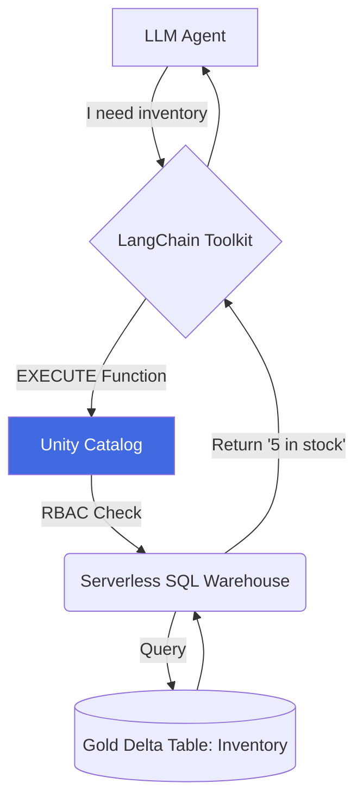

# Lesson 10: Unity Catalog Functions & Tool Calling

Our Agent currently has one tool: `document_retriever`. This tool is just a Python function wrapped in a `@tool` decorator. But what happens when another team wants to use our tool? They have to copy-paste our Python code. This is an anti-pattern. 

## 1. Business Context

**Who requested this?**
Data Governance & Platform Engineering.

**Why?**
We need a centralized registry of "Agent Tools" (functions) just like we have a centralized registry of data tables. If a tool calculates "Customer LTV", there should only be *one* source of truth for that calculation, governed by Unity Catalog.

**Business Impact**
Tool reusability and strict governance. You can grant access to a Tool the same way you grant access to a Table.

**Customer Problem**
"Team A's agent says the product is out of stock, but Team B's agent says it has 5 left in stock. They are using different Python logic to check inventory."

**ROI & Metrics**
*   **Time-to-Market:** New agents can be built in days instead of months by reusing governed UC Functions.

---

## 2. Simple Analogy

*   **Local Python Tool:** You invent a special wrench and keep it in your own toolbox. Nobody else can use it unless you build them a replica.
*   **Unity Catalog Function:** You put the wrench in the central corporate tool library. Anyone with the right ID card (RBAC permissions) can check it out and use it.

---

## 3. First Principles

*   **What:** Registering Python or SQL functions directly inside Databricks Unity Catalog.
*   **Why:** To provide governed, discoverable, and language-agnostic tools to AI Agents.
*   **How:** Using `CREATE FUNCTION` in SQL or the Databricks SDK in Python.
*   **When:** When a tool needs to interact with corporate data (e.g., checking inventory in a Delta table).
*   **Tradeoffs:** UC Functions run on Databricks serverless compute. This adds a slight network latency compared to running a pure Python function locally in memory.
*   **Failure Scenarios:** The Agent tries to call the UC function, but the Agent's Service Principal lacks `EXECUTE` permissions on the function in Unity Catalog.

---

## 4. Internal Working

1.  **Registration:** A Data Engineer writes a function `get_inventory(sku: str)`. They register it in UC: `catalog.schema.get_inventory`.
2.  **Tool Binding:** The AI Agent is given the name of the function. Databricks automatically reads the function's schema (inputs/outputs) and docstring from UC and passes it to the LLM.
3.  **Execution:** The LLM decides to check inventory. It outputs a JSON payload: `{"sku": "12345"}`.
4.  **Serverless Execution:** LangChain automatically passes this payload to the Databricks UC Function endpoint, executes the SQL/Python logic on a serverless warehouse, and returns the result to the LLM.

---

## 5. Databricks Implementation

This is a unique feature of Databricks Mosaic AI. 
Instead of defining `@tool` in Python, we use the `UCFunctionToolkit` from LangChain. This toolkit automatically imports governed functions from Unity Catalog and converts them into LLM-ready tools.

---

## 6. Production Code

We will create `src/agent/tools.py` in the new directory.
This script demonstrates how to create a UC function and load it as a tool.

*(See the actual file in your workspace for the code)*

---

## 7. Explain Every Line of Code

Looking at `src/agent/tools.py`:
*   `spark.sql("CREATE OR REPLACE FUNCTION...")`: We are creating a User-Defined Function (UDF) directly in Unity Catalog. Note the `COMMENT`. The LLM reads this comment to know what the tool does.
*   `RETURNS STRING`: Strongly typing the output.
*   `LANGUAGE PYTHON`: UC supports SQL or Python. We use Python here for complex logic.
*   `from langchain_community.tools.databricks import UCFunctionToolkit`: The bridge between Unity Catalog and LangChain.
*   `toolkit.get_tools()`: Automatically fetches the schema, docstring, and execution path for the functions and makes them ready for the `AgentExecutor`.

---

## 8. Architecture Diagram

---

## 9. Production Problems

**The Problem: The Vague Docstring**
A junior engineer writes a UC function and gives it the comment: `COMMENT 'Gets data'`. The Agent will never use it, or will use it incorrectly, because it doesn't know what "data" means or what the input parameters require.
*   **The Senior Solution:** Treat tool docstrings as "Prompt Engineering". A good UC function comment is: `COMMENT 'Fetches the current inventory count for a given SKU string. Use this ONLY when the user explicitly asks if an item is in stock.'`

---

## 10. Design Decisions

**Python `@tool` vs Unity Catalog Function**
*   If the tool is purely utility (e.g., `get_current_time()` or `calculate_math_equation()`), keep it as a local Python `@tool` to avoid network overhead.
*   If the tool accesses data (e.g., `query_database`, `get_customer_profile`), it **MUST** be a UC Function so that Unity Catalog can enforce row-level security and audit logging.

---

## 11. Cost Engineering

Executing a UC function spins up (or utilizes an existing) Serverless SQL Warehouse. 
*   **Optimization:** Ensure the Serverless Warehouse is configured to auto-scale rapidly and shut down aggressively (e.g., 5 minutes of inactivity). If you have thousands of agents calling tools constantly, a persistent warehouse is cheaper than spinning one up for every query.

---

## 12. Interview Preparation (Senior Level)

1.  **Architecture:** "How do you enforce data governance (RBAC) when an autonomous AI agent is executing database queries on behalf of a user?"
2.  **System Design:** "Compare the architecture of storing tools as Python modules vs storing them as governed functions in a data catalog."
3.  **Debugging:** "Your agent is hallucinating the input parameters for a tool. How do you fix this?" (Answer: Improve the Tool's docstring/schema definition).
4.  **Coding:** "Write the SQL syntax to register a Python UDF in Unity Catalog."
