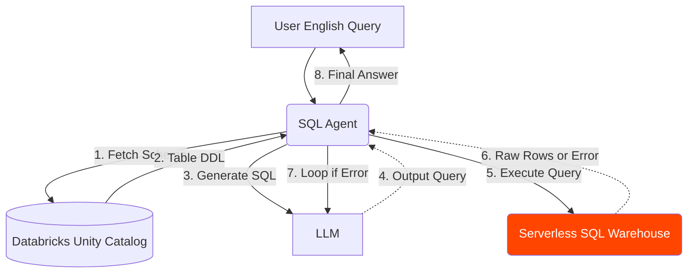

# Lesson 11: The SQL Agent

We have an agent that can read unstructured PDF manuals (via Vector Search) and check specific scalar values (via the `check_inventory` UC function). But what if the user asks a complex analytical question about our Gold tables? 

"What were the top 3 selling coffee machines in the North region last month?"

## 1. Business Context

**Who requested this?**
Data Analysts and Regional Managers.

**Why?**
They don't want to write SQL. They want to ask questions in plain English and get data-driven answers from the Data Warehouse.

**Business Impact**
Democratization of data. Business users can self-serve complex analytics without waiting for the Data Team to build a dashboard.

**Customer Problem**
"I need a report on Q3 sales, but the data engineering team's backlog is 4 weeks long."

**ROI & Metrics**
*   **Ad-hoc Query Resolution:** Reduce time-to-insight for non-technical users from weeks to seconds.

---

## 2. Simple Analogy

*   **Retriever Tool:** The librarian who finds books for you.
*   **UC Function Tool:** The receptionist who can answer one specific question ("Are we open?").
*   **SQL Agent:** You hire a Junior Data Analyst. You tell them what you want. They look at the database schema, write a SQL query, run it, look at the results, fix their syntax errors, run it again, and hand you the final chart.

---

## 3. First Principles

*   **What:** Giving an LLM the ability to write and execute arbitrary SQL queries against your database.
*   **Why:** Because vector search cannot do math, aggregations (`GROUP BY`), or sorting (`ORDER BY`).
*   **How:** By providing the LLM with the database schema as context, and a tool that allows it to execute queries on a SQL Warehouse.
*   **When:** When the user intent requires querying structured tabular data.
*   **Tradeoffs:** Security is paramount. You are letting an AI write SQL on your production data.
*   **Failure Scenarios:** 
    *   **Syntax Errors:** The LLM hallucinates a column name that doesn't exist.
    *   **Cost Explosion:** The LLM writes a `CROSS JOIN` between two billion-row tables and crashes the warehouse.
    *   **Security Breach:** The LLM executes a `DROP TABLE` or reads PII it shouldn't access.

---

## 4. Internal Working

1.  **User:** "How many stores in NY sold over 100 units?"
2.  **Schema Fetch:** The Agent reads the table schemas (e.g., `stores`, `sales`).
3.  **SQL Generation:** The LLM writes: `SELECT count(store_id) FROM sales WHERE state='NY' AND units > 100`.
4.  **Execution Tool:** The Agent executes the query against Databricks SQL.
5.  **Error Correction:** If Databricks returns `Error: Column 'units' not found`, the Agent sees the error, rewrites the query to use `quantity_sold`, and tries again.
6.  **Synthesis:** The Agent takes the returned rows `[(45,)]` and says "There are 45 stores in NY that met that criteria."

---

## 5. Databricks Implementation

This is where Unity Catalog shines. 
*   **Governance:** We do *not* use a generic database connection string. We use the Databricks SQL connector. 
*   **Service Principal:** The Agent runs as a Service Principal. Unity Catalog ensures this Principal *only* has `SELECT` access on specific Gold tables. It physically cannot drop a table.
*   **Databricks SQL Warehouse:** Provides rapid execution of the generated queries.

---

## 6. Production Code

We will create `src/agent/sql_agent.py` in the new directory.

*(See the actual file in your workspace for the code)*

---

## 7. Explain Every Line of Code

Looking at `src/agent/sql_agent.py`:
*   `from langchain_community.agent_toolkits import create_sql_agent`: LangChain has a pre-built orchestration loop specifically tuned for SQL.
*   `from langchain_community.utilities import SQLDatabase`: The abstraction layer for the database connection.
*   `databricks+tcp://...`: The SQLAlchemy connection string format for Databricks.
*   `include_tables=["shopsphere_gold.sales_aggregated"]`: **Critical Guardrail.** Never give the agent access to the entire catalog. Explicitly whitelist the tables it is allowed to query. This prevents it from getting confused by irrelevant tables or wasting tokens reading massive schemas.
*   `agent_type="tool-calling"`: We use the modern tool-calling paradigm rather than the older zero-shot ReAct, as it is much better at fixing its own SQL syntax errors.

---

## 8. Architecture Diagram

---

## 9. Production Problems

**The Problem: Massive Schemas**
If your database has 500 tables, each with 100 columns, passing the schema to the LLM will exceed the 128k context window and cost a fortune per query.
*   **The Senior Solution:** Dynamic Schema Retrieval. Instead of passing the whole schema, you give the Agent a tool called `search_schema`. The Agent searches for "sales tables", gets a list of 5 tables, then asks for the DDL of only the 1 relevant table. Databricks handles this natively in its enterprise Genie offering.

**The Problem: The "SELECT *" Disaster**
The user asks "Show me all sales data." The LLM writes `SELECT * FROM sales`. The table has 10 billion rows. The query hangs, the Agent crashes, and the Warehouse bills you for massive compute.
*   **The Senior Solution:** Prompt Engineering & Limits. Modify the SQL Agent's system prompt: `"Always append LIMIT 10 to your queries unless the user specifically asks for an aggregation."`

---

## 10. Design Decisions

**LangChain SQL Agent vs Databricks Genie**
For a production environment today, Databricks **Genie** (their managed text-to-SQL UI) is often superior to building a LangChain SQL Agent from scratch because it handles dynamic schema filtering and semantic caching natively. However, if you are building a custom multi-agent system where SQL is just *one* of many tools (e.g., retrieving PDFs *and* querying SQL), building it in LangChain/LangGraph is required for full orchestration control.

---

## 11. Cost Engineering

*   **Compute Isolation:** Do not run Agent SQL queries on your heavy ETL warehouse. Create a dedicated "Agent-Serving Serverless SQL Warehouse" sized at 2X-Small or Small. The queries generated by LLMs are usually aggregations, not massive joins, so scaling *out* (concurrency) is more important than scaling *up* (cluster size).

---

## 12. Interview Preparation (Senior Level)

1.  **System Design:** "How do you securely implement a Text-to-SQL agent on a database containing PII?" (Answer: Service Principals + Unity Catalog Row/Column level security).
2.  **Debugging:** "Your SQL agent keeps failing with 'Token limit exceeded' before it even executes a query. Why?" (Answer: The schema it's trying to read is too large for the prompt).
3.  **Tradeoffs:** "Compare the performance of a naive SQL agent vs one using dynamic schema retrieval."
4.  **Cost:** "How do you prevent a malicious or confused agent from running a billion-row cross-join that bankrupts your cloud account?"

---

## 13. Resume Thinking

**How to talk about this project:**
*   **Bullet:** *Developed an autonomous Text-to-SQL agent using LangChain and Databricks SQL, enabling self-service analytics for business users while enforcing strict Unity Catalog governance and read-only query guardrails.*
