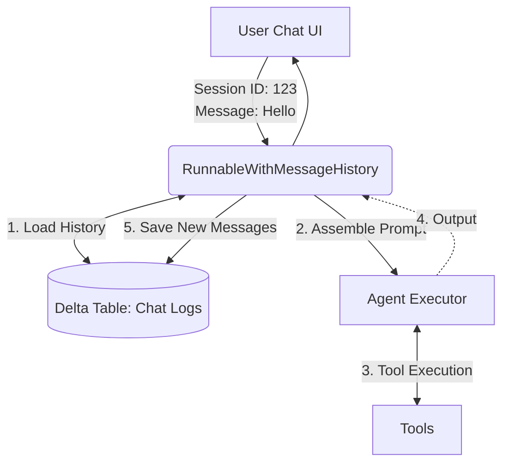

# Lesson 12: Memory & Reasoning

Our Single Agent (Lesson 9) and SQL Agent (Lesson 11) are stateless. If you ask, "What is the return policy for the espresso machine?" and then ask, "Does that apply to the accessories too?", the agent forgets the first question and fails to answer the second.

## 1. Business Context

**Who requested this?**
UX/UI Design Team.

**Why?**
Humans communicate with context. Having to re-state the entire premise of the conversation in every message is incredibly frustrating for users.

**Business Impact**
Increases adoption of the Copilot. A frustrating UX leads to users abandoning the tool and going back to the IT Helpdesk.

**Customer Problem**
"The AI has gold-fish memory. It keeps asking me to repeat myself."

**ROI & Metrics**
*   **User Retention:** Increase 30-day active user retention on the Copilot from 20% to 60%.

---

## 2. Simple Analogy

Imagine calling a Customer Service hotline.
*   **Stateless Agent:** Every time you reply to the agent, they hang up, you have to call back, get a new agent, and explain your entire problem from the beginning.
*   **Agent with Memory:** You stay on the line with the same agent for the whole conversation. They remember what you said 5 minutes ago.

---

## 3. First Principles

*   **What:** Passing previous conversation turns (Human and AI messages) back into the LLM prompt.
*   **Why:** Because LLMs are inherently stateless APIs. They have no internal memory of previous API calls.
*   **How:** Using LangChain's `RunnableWithMessageHistory` or memory buffers.
*   **When:** Any time you are building a chat-based interface.
*   **Tradeoffs:** Every previous message you append to the prompt consumes tokens. A long conversation will quickly hit the token limit and cost a lot of money.
*   **Failure Scenarios:** "Context Exhaustion." The chat history gets so long it exceeds the 128k context window, and the API throws an error.

---

## 4. Internal Working

1.  **Turn 1 (User):** "Hi, I'm John."
2.  **Turn 1 (LLM):** "Hello John!" (Memory stores: `[User: Hi I'm John, AI: Hello John!]`)
3.  **Turn 2 (User):** "What is my name?"
4.  **Prompt Assembly:** The orchestrator prepends the Memory array to the new prompt.
    ```text
    System: You are an assistant.
    History: 
    User: Hi, I'm John.
    AI: Hello John!
    Current: What is my name?
    ```
5.  **Turn 2 (LLM):** "Your name is John."

---

## 5. Databricks Implementation

In a production Databricks environment, you don't store memory in local RAM (because your Streamlit app might restart, or multiple users might hit different load-balanced containers). You must persist memory in a database. We will use a Delta table (or a fast Key-Value store if low latency is critical) to store session histories, keyed by a `session_id`.

---

## 6. Production Code

We will create `src/agent/memory.py` in the new directory.

*(See the actual file in your workspace for the code)*

---

## 7. Explain Every Line of Code

Looking at `src/agent/memory.py`:
*   `from langchain_core.chat_history import BaseChatMessageHistory`: We implement the base class to create a custom memory backend.
*   `class DeltaChatMessageHistory`: Our custom class that saves messages to a Databricks Delta table.
*   `self.session_id`: Essential for multi-tenant apps. John's chat must not bleed into Mary's chat.
*   `from langchain_core.runnables.history import RunnableWithMessageHistory`: This wraps our existing agent (from Lesson 9) and automatically injects the history into the `{chat_history}` prompt variable before execution, and saves the output afterward.

---

## 8. Architecture Diagram



---

## 9. Production Problems

**The Problem: The Endless Conversation**
A user keeps a chat window open for 3 weeks and asks 500 questions. The prompt becomes 150,000 tokens long. The LLM crashes.
*   **The Senior Solution:** **Conversation Summary Memory.** Instead of appending the raw text of all 500 messages, you run a *background LLM task* every 10 messages that says: "Summarize the previous conversation." You store the summary (e.g., "User is John, discussing a broken espresso machine return") and drop the raw logs. This caps your token usage permanently.

---

## 10. Design Decisions

**Why store memory in Delta Lake instead of Redis?**
Redis is faster (sub-millisecond). However, Delta Lake allows our Data Science team to natively query the `chat_logs` table using SQL to analyze user behavior, perform sentiment analysis, and evaluate the LLM's performance over time (which we will do in Phase 4). For a chat application, Delta's append latency (~500ms) is usually acceptable. If it becomes a bottleneck, we use Redis for live memory and asynchronously sync to Delta for analytics.

---

## 11. Cost Engineering

*   **Cost per turn:** If the history is 2000 tokens, every new question costs $0.0018 (Input) before the LLM even generates a response.
*   **Optimization:** Implement a `ConversationBufferWindowMemory` (only keep the last K=5 interactions) to strictly bound costs for standard tier users, reserving full history for premium users.

---

## 12. Interview Preparation (Senior Level)

1.  **Architecture:** "How do you manage state for 10,000 concurrent users talking to an LLM agent?"
2.  **System Design:** "Your token costs are growing linearly with the length of a user's conversation. Design a system to flatten this cost curve." (Answer: Summary Memory).
3.  **Tradeoffs:** "Compare storing chat history in Redis vs Delta Lake."
4.  **Debugging:** "The agent remembers the user's name, but when it uses a tool, the tool fails because it lacks context. Why?" (Answer: The LLM was given the memory, but the Agent didn't pass the necessary context *into the tool's input parameters*).
5.  **Coding:** "Write a Python class that inherits from BaseChatMessageHistory to save LangChain messages to a database."

---

## 13. Resume Thinking

**How to talk about this project:**
*   **Bullet:** *Architected a scalable, stateful conversational memory backend on Delta Lake, enabling multi-turn reasoning for the AI Agent while providing native analytics capabilities for chat log analysis.*
