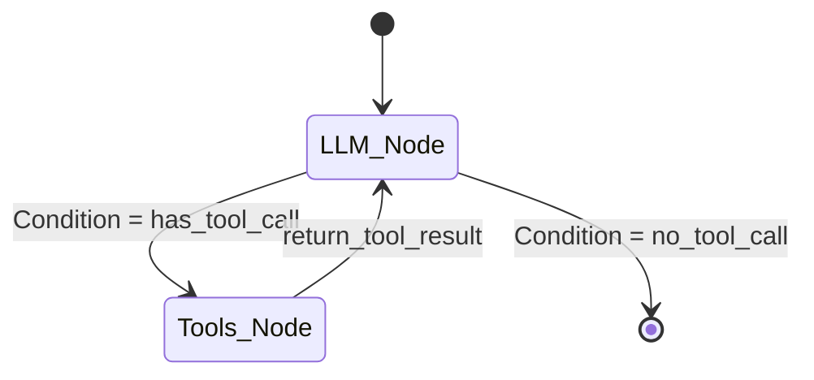

# Lesson 13: Agent Frameworks (LangGraph)

Our agent has memory and tools. But the orchestration logic (the `AgentExecutor`) is a black box. What if we want the agent to use the SQL tool first, and *if* it fails, fall back to the Vector Search tool? We can't easily express that complex logic in standard LangChain. We need a state machine.

## 1. Business Context

**Who requested this?**
Platform Architects.

**Why?**
Enterprise workflows are complex. "Check inventory. If out of stock, check vendor lead time. If lead time > 1 week, draft an email to the customer offering a substitute." A simple while-loop agent cannot guarantee this sequence.

**Business Impact**
Predictability and safety. We can hardcode the business rules (the graph edges) while letting the AI handle the language and extraction (the graph nodes).

**Customer Problem**
"The AI keeps trying to check inventory for items it already knows are discontinued, wasting time and compute."

**ROI & Metrics**
*   **Workflow Reliability:** Increase the successful completion rate of multi-step autonomous tasks from 40% (ReAct Agent) to 95% (State Graph).

---

## 2. Simple Analogy

*   **Standard Agent (`AgentExecutor`):** Giving a contractor a budget and a goal ("Build a house") and letting them figure out the steps in whatever order they want.
*   **LangGraph:** Giving a contractor a highly detailed blueprint and a flowchart. "You MUST build the foundation first. If it rains, you MUST switch to framing the indoor walls."

---

## 3. First Principles

*   **What:** Modeling an AI agent as a cyclical graph (State Machine).
*   **Why:** To gain granular control over the agent's flow, enabling loops, conditional branching, and human-in-the-loop (approval) steps.
*   **How:** Using **LangGraph** (or similar frameworks like CrewAI/AutoGen, but Databricks specifically natively integrates LangGraph).
*   **When:** When moving an agent from an experimental chat bot to a production workflow automation engine.
*   **Tradeoffs:** High developer complexity. You have to write much more boilerplate code to define nodes, edges, and state objects compared to a 1-line `create_tool_calling_agent`.
*   **Failure Scenarios:** State bloating. If you store too much data in the graph's `State` object, passing it between nodes consumes too much memory/tokens.

---

## 4. Internal Working

1.  **Define State:** Create a `TypedDict` that holds the entire state of the execution (e.g., `messages`, `current_inventory`, `customer_email`).
2.  **Define Nodes:** Create Python functions. One node is the LLM. One node executes the Vector Search. One node executes SQL.
3.  **Define Edges:** Connect the nodes. `Node LLM` points to `Node SQL` *if* the LLM outputs a tool call for SQL.
4.  **Execute:** You pass the initial user message into the graph. It flows through the nodes, updating the state at each step, until it reaches the `__END__` node.

---

## 5. Databricks Implementation

Databricks MLflow natively traces LangGraph executions. When you look at an MLflow Trace for a LangGraph run, you don't just see a text log; you see the visual graph and can inspect the State object at every single node transition. This is the ultimate debugging tool.

---

## 6. Production Code

We will create `src/agent/graph.py` in the new directory.

*(See the actual file in your workspace for the code)*

---

## 7. Explain Every Line of Code

Looking at `src/agent/graph.py`:
*   `class AgentState(TypedDict):` The most important part. This is the shared memory between all nodes. `messages` is an `Annotated` list with an `add_messages` reducer, meaning new messages append to the list instead of overwriting it.
*   `def call_model(state: AgentState):` A node. It takes the current state, runs the LLM, and returns an updated state.
*   `def should_continue(state: AgentState):` A conditional edge. It inspects the last message. If the LLM returned a `tool_calls` object, we route to the `tools` node. Otherwise, we route to `__END__`.
*   `workflow.add_node(...)` & `workflow.add_edge(...)`: We explicitly build the flowchart.
*   `checkpointer = MemorySaver()`: LangGraph has built-in persistence. This replaces our custom Delta Lake history from Lesson 12 with a built-in framework that can also save to PostgreSQL or SQLite.

---

## 8. Architecture Diagram

---

## 9. Production Problems

**The Problem: The Endless Error Loop**
The LLM calls a tool. The tool throws an error ("Schema not found"). The LLM tries the exact same tool call again. It loops infinitely.
*   **The Senior Solution:** State-based circuit breakers. Add an `error_count` integer to the `AgentState`. In the `should_continue` conditional edge, add: `if state['error_count'] > 3: return "human_fallback_node"`.

---

## 10. Design Decisions (Framework Comparison)

| Framework | Pros | Cons | Best For |
| :--- | :--- | :--- | :--- |
| **LangGraph** | Highly controllable, state machine, cyclical. Native Databricks support. | Steep learning curve, verbose. | Production enterprise workflows. |
| **CrewAI** | Multi-agent collaboration (Agent A talks to Agent B). | Hard to control execution path exactly. | Brainstorming, complex multi-persona tasks. |
| **AutoGen** | Microsoft backed, great code execution. | Can be chaotic when agents converse infinitely. | Software engineering AI agents. |

*Decision:* We use LangGraph because Databricks MLflow tracing makes debugging state machines incredibly easy, and we need deterministic flow control for corporate data.

---

## 11. Cost Engineering

LangGraph allows you to route around the LLM. 
*   **Optimization:** Create a node *before* the LLM called `cache_check_node`. If the user asks a frequent question, this node returns the answer and routes directly to `__END__`, bypassing the LLM entirely and reducing costs to $0.

---

## 12. Interview Preparation (Senior Level)

1.  **Architecture:** "Why would you migrate a production AI system from LangChain's AgentExecutor to LangGraph?" (Answer: Predictability, state management, and human-in-the-loop capabilities).
2.  **System Design:** "Design a LangGraph workflow that requires a human manager to approve an action before the agent sends an email." (Answer: Use a breakpoint before the email node, persist state, and wait for external input).
3.  **Debugging:** "In LangGraph, if a node crashes, does the whole graph fail? How do you recover?" (Answer: LangGraph's checkpointer saves state at every node. You can catch the error, fix the code, and resume the graph from the exact node it failed on).
4.  **Coding:** "Write the Python code to define a conditional edge in LangGraph."

---

## 13. Resume Thinking

**How to talk about this project:**
*   **Bullet:** *Re-architected the Copilot orchestration logic from black-box agents to deterministic state machines using LangGraph, ensuring 100% compliance with corporate workflow routing rules and enabling human-in-the-loop approvals.*
