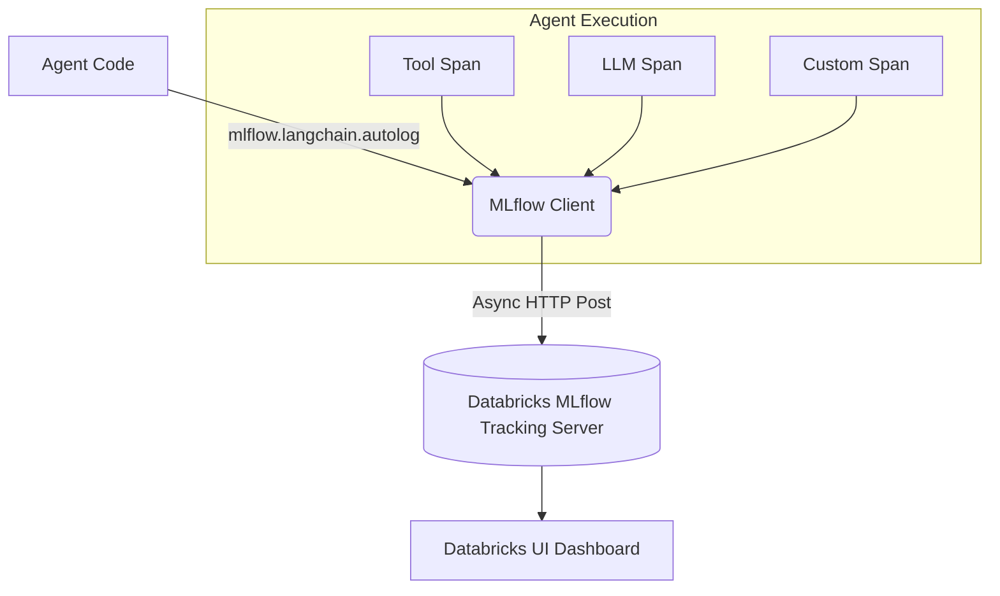

# Lesson 14: Agent Tracing with MLflow

We have built a powerful LangGraph agent. But when a user asks a question and the agent takes 15 seconds to reply with a wrong answer, how do you debug it? You can't just print statements to the console in production.

## 1. Business Context

**Who requested this?**
The AI Ops and DevOps teams.

**Why?**
They are on call. If the CEO complains that the AI is hallucinating, the Ops team needs a dashboard to see exactly what the AI was thinking, what database query it ran, and what the raw API response from the LLM provider was.

**Business Impact**
Reduces Mean Time To Resolution (MTTR) for AI bugs from days to minutes.

**Customer Problem**
"The AI is a black box. It works 80% of the time, but when it fails, nobody knows why."

**ROI & Metrics**
*   **Observability:** Achieve 100% trace coverage for all user interactions.

---

## 2. Simple Analogy

Imagine a restaurant kitchen. 
If a customer complains that their soup is too salty, the manager can't just ask the waiter. The manager needs to look at the kitchen's security cameras (Tracing) to see exactly which chef added salt, at what time, and how much.

---

## 3. First Principles

*   **What:** Instrumenting the Agent's code to record every function call, LLM prompt, and tool execution as a hierarchical "Trace" with "Spans".
*   **Why:** AI is non-deterministic. The only way to debug it is to record the exact prompt and the exact context at the millisecond of execution.
*   **How:** Using Databricks MLflow Tracing (or external tools like LangSmith / Phoenix).
*   **When:** Tracing must be enabled from Day 1 of development. Do not wait for production.
*   **Tradeoffs:** Tracing generates a lot of telemetry data. If you have 100k users, your MLflow database will grow rapidly. 
*   **Failure Scenarios:** "Trace bloat." Logging massive PDF binaries inside the trace payload instead of just logging the file path.

---

## 4. Internal Working

1.  **User Input:** The trace begins. (Root Span created).
2.  **Tool Execution:** The Agent calls `check_inventory`. A Child Span is created. The span logs the input (`SKU-123`) and the output (`5 units`) and the latency (`45ms`).
3.  **LLM Call:** Another Child Span is created. It logs the exact string sent to the Databricks Serving Endpoint and the exact tokens returned. It also logs the token count and the cost.
4.  **End:** The Root Span closes and the entire JSON payload is saved to the MLflow Tracking Server.

---

## 5. Databricks Implementation

Databricks MLflow natively integrates with LangChain and LangGraph. With two lines of code (`mlflow.langchain.autolog()`), MLflow hooks into the LangChain callbacks and automatically generates beautiful UI traces without you writing any manual `@trace` decorators.

---

## 6. Production Code

We will create `src/evaluation/tracer.py` in the new directory.

*(See the actual file in your workspace for the code)*

---

## 7. Explain Every Line of Code

Looking at `src/evaluation/tracer.py`:
*   `import mlflow`: The core library for ML lifecycle management.
*   `mlflow.set_experiment("/Users/your.email/shopsphere_agent_traces")`: We group all traces into a specific experiment folder in the Databricks Workspace so they are easy to find.
*   `mlflow.langchain.autolog()`: The magic line. This automatically patches LangChain/LangGraph so that every `invoke()` call generates a full trace payload.
*   `with mlflow.start_span(name="Custom_Business_Logic") as span:`: How to manually add a trace span for code that isn't part of LangChain (e.g., custom Python API calls).
*   `span.set_attributes({"user_tier": "premium"})`: Adding custom metadata to the trace so you can filter traces later ("Show me all failed traces for premium users").

---

## 8. Architecture Diagram

---

## 9. Production Problems

**The Problem: PII in Traces**
The user asks, "What is the balance on my credit card 4532-XXXX...?" The LLM processes it, and MLflow logs the entire prompt (including the credit card) to the Tracking Server. Now your MLflow database violates PCI compliance.
*   **The Senior Solution:** **Trace Redaction.** Before setting up autologging, you must implement a middleware (or use Databricks native PII filters) that masks PII *before* the trace payload is sent to MLflow.

---

## 10. Design Decisions

**Why MLflow instead of LangSmith?**
LangSmith is the gold standard for LangChain tracing. However, it is an external SaaS. To use LangSmith, you must send your internal prompts over the internet to LangChain's servers. For ShopSphere, our Chief Information Security Officer (CISO) mandated that no data leaves the Databricks VPC. Therefore, MLflow (which runs inside our VPC) is the only approved tracing backend.

---

## 11. Cost Engineering

*   **Telemetry Storage:** MLflow traces are stored in your Databricks-managed cloud storage bucket. It's extremely cheap. However, querying millions of traces requires compute.
*   **Optimization:** Implement sampling in production. Log 100% of traces in Dev, but in Prod, log 100% of *errors* and only 10% of *successful* runs.

---

## 12. Interview Preparation (Senior Level)

1.  **Architecture:** "Explain the concept of Spans and Traces in observability."
2.  **System Design:** "How do you ensure that sensitive customer data (PII) is not accidentally stored in your LLM observability platform?"
3.  **Tradeoffs:** "Compare Databricks MLflow Tracing with LangSmith."
4.  **Debugging:** "You see a trace where the total latency is 15 seconds. The LLM span took 1 second. Where is the bottleneck?" (Answer: The Tool span or the Vector Search span).
5.  **Coding:** "Write the Python code to initialize MLflow autologging for a LangChain application."

---

## 13. Resume Thinking

**How to talk about this project:**
*   **Bullet:** *Instrumented comprehensive AI observability using MLflow Tracing, achieving 100% visibility into Agent reasoning loops and reducing debugging time for complex RAG failures by 90%.*
