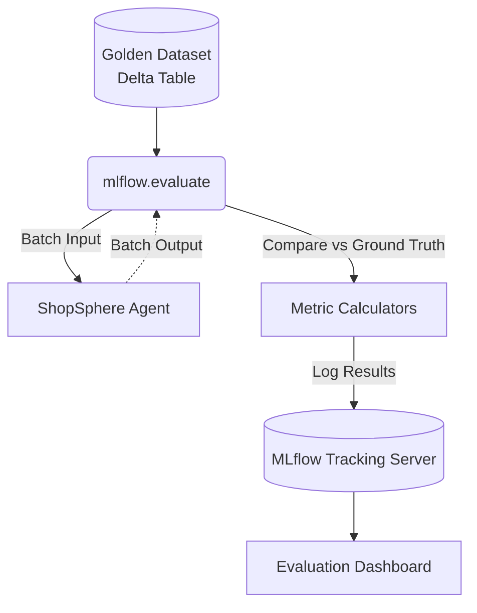

# Lesson 15: Evaluation & Benchmarking

We can now build an Agent and trace its execution. But how do we know if it's actually *good*? In traditional software engineering, we write unit tests (`assert 2+2 == 4`). In AI, testing is vastly more complex because the output is non-deterministic natural language.

## 1. Business Context

**Who requested this?**
Executive Leadership & QA Team.

**Why?**
Before deploying to 10,000 store managers, leadership needs a quantitative metric proving the AI won't give disastrous advice (like telling a manager to honor a refund that violates policy).

**Business Impact**
Allows safe, continuous deployment (CI/CD) of LLM applications. You cannot deploy what you cannot measure.

**Customer Problem**
"We changed the system prompt to make the AI more polite, but accidentally broke its ability to query SQL."

**ROI & Metrics**
*   **Evaluation Coverage:** Run an automated 100-question benchmark suite on every pull request, calculating an overall Accuracy Score.

---

## 2. Simple Analogy

"Vibes-based" evaluation is like a chef tasting a soup, shrugging, and saying "Tastes good to me."
Benchmarking is like a health inspector taking a sample of the soup, running a chemical analysis, and proving it contains exactly 1.2 grams of salt and zero bacteria.

---

## 3. First Principles

*   **What:** Systematically measuring the performance of an AI application against a golden dataset.
*   **Why:** To prevent regressions during refactoring, prompt tweaking, or model upgrades.
*   **How:** By collecting an Evaluation Dataset (Input Question, Expected Context, Expected Answer) and running metrics against it.
*   **When:** Constantly. During development, before deployment, and continuously in production.
*   **Tradeoffs:** Building a high-quality evaluation dataset is incredibly tedious and expensive (often requiring domain experts to write the golden answers). 
*   **Failure Scenarios:** "Overfitting the Benchmark." The developer tweaks the system prompt specifically to pass the 100 test questions, but the AI fails on real-world questions it hasn't seen before.

---

## 4. Internal Working

1.  **Dataset Creation:** A CSV file with columns: `question`, `ground_truth_answer`.
2.  **Inference Run:** A Python script loops through the CSV. For every `question`, it calls our Agent and records the `agent_answer`.
3.  **Metric Calculation:** A scoring algorithm compares `agent_answer` to `ground_truth_answer`. (e.g., String Exact Match, ROUGE score, or LLM-as-a-Judge).
4.  **Reporting:** The script outputs a final score (e.g., 85% Accuracy).

---

## 5. Databricks Implementation

We use **Databricks Mosaic AI Model Evaluation**. 
This is a native feature in MLflow. Instead of writing custom for-loops, we use `mlflow.evaluate()`. We pass it our Agent and our Evaluation Dataset. It automatically distributes the inference across a Spark cluster, calculates industry-standard metrics, and logs a beautiful dashboard to the MLflow experiment.

---

## 6. Production Code

We will create `src/evaluation/evaluator.py` in the new directory.

*(See the actual file in your workspace for the code)*

---

## 7. Explain Every Line of Code

Looking at `src/evaluation/evaluator.py`:
*   `import pandas as pd`: We load our golden dataset into a Pandas DataFrame.
*   `eval_data = pd.DataFrame(...)`: In reality, you load this from a Delta Table that your human annotators curate.
*   `mlflow.evaluate(...)`: The core Databricks Evaluation API.
*   `model=agent_function`: We pass a wrapper function that takes a question and returns the agent's answer.
*   `data=eval_data`: Our golden dataset.
*   `model_type="question-answering"`: Tells MLflow which default metrics to calculate (e.g., Exact Match, F1 score).
*   `evaluators="default"`: Uses the built-in Databricks evaluation engine.

---

## 8. Architecture Diagram

---

## 9. Production Problems

**The Problem: The "Exact Match" Failure**
Ground Truth: "The store opens at 9 AM."
Agent Answer: "Store hours begin at 9:00 AM."
If you use traditional software metrics like String Exact Match, the AI scores a 0/100 (Fail), even though the answer is perfectly correct.
*   **The Senior Solution:** You cannot use traditional string matching for generative AI. You must use LLM-as-a-Judge (covered in Lesson 16) to semantically score the answers.

---

## 10. Design Decisions

**Why not just use humans to evaluate the AI?**
Human evaluation is the gold standard but it does not scale. A team of 5 domain experts can perhaps evaluate 100 answers a day. If you make a prompt change and need to re-run the benchmark, you can't wait a day. You need automated evaluation for CI/CD speed, reserving humans only for final sanity checks or edge cases.

---

## 11. Cost Engineering

*   **Eval Run Costs:** Running `mlflow.evaluate` on 1,000 questions means you are making 1,000 API calls to your Agent. If your agent uses 5000 tokens per call, that's 5 million tokens. 
*   **Optimization:** Create small, targeted datasets. Have a "Smoke Test" dataset (10 questions) that runs on every Git Commit. Have a "Full Benchmark" dataset (1000 questions) that only runs on Friday night before a production release.

---

## 12. Interview Preparation (Senior Level)

1.  **Architecture:** "How do you integrate LLM evaluation into a standard CI/CD pipeline?"
2.  **System Design:** "Design a system for continuously collecting 'Golden Data' from end users in production." (Answer: Thumbs Up/Thumbs Down feedback buttons in the UI, routed to a Delta Table).
3.  **Tradeoffs:** "Why is ROUGE score generally a poor metric for evaluating RAG applications?"
4.  **Debugging:** "Your benchmark score dropped from 90% to 60% after you increased the Vector Search `top_k` from 3 to 10. Why?" (Answer: The LLM is getting confused by too much irrelevant context—Lost in the Middle).
5.  **Coding:** "Write the Python code to execute a batch evaluation job using MLflow."

---

## 13. Resume Thinking

**How to talk about this project:**
*   **Bullet:** *Established an automated CI/CD evaluation framework using MLflow Evaluate, running benchmark suites against a curated golden dataset to ensure zero-regression deployments of the LLM Agent.*
