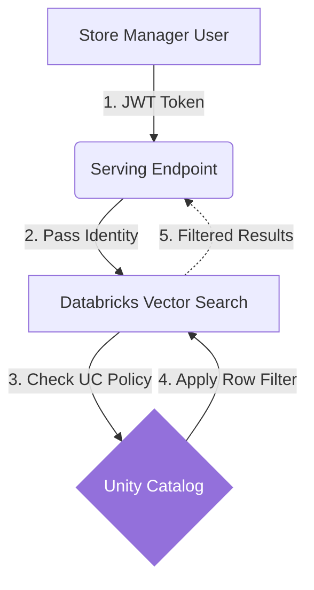

# Lesson 18: Governance & Dataset Licensing

We have secured the AI against hackers. Now we must secure the AI against *ourselves* (and our lawyers). 

## 1. Business Context

**Who requested this?**
The Legal and Compliance Departments.

**Why?**
If you train or fine-tune an AI model on a dataset licensed under GPL, your entire proprietary application might suddenly become open-source by legal requirement. If your RAG agent accidentally retrieves a document labeled "Confidential: HR Only" and shows it to a store manager, the company faces massive liability.

**Business Impact**
Ensures the AI platform complies with SOC2, GDPR, HIPAA, and internal intellectual property policies.

**Customer Problem**
"The AI answered my question by quoting a document I shouldn't have access to."

**ROI & Metrics**
*   **Compliance Violations:** Zero data leakage across tenant boundaries or RBAC levels.

---

## 2. Simple Analogy

Imagine building a super-efficient sorting machine (the AI) inside a bank.
*   **Security (Guardrails):** Making sure robbers can't break into the sorting machine.
*   **Governance:** Making sure that when the bank teller uses the sorting machine, the machine doesn't accidentally hand them the CEO's personal paycheck. The machine must check the teller's ID badge (RBAC) before dispensing a document.

---

## 3. First Principles

*   **What:** Applying rigorous access controls (RBAC/ABAC) and licensing checks to the data *entering* the AI system, and the AI models themselves.
*   **Why:** AI does not bypass standard data governance; it requires *stricter* governance because it synthesizes data in unpredictable ways.
*   **How:** Using Databricks Unity Catalog for unified governance across Files (Volumes), Tables (Delta), Vectors (Search Indexes), and Models (Model Registry).
*   **When:** Integrated deeply into the architecture from Day 1.
*   **Tradeoffs:** Enforcing Row-Level Security on a Vector Database during retrieval adds latency and engineering complexity.
*   **Failure Scenarios:** "Data Leakage via Synthesis." The agent reads 5 confidential documents and outputs a summary. The user didn't see the original documents, but they saw the summarized secret.

---

## 4. Internal Working (Unity Catalog)

Unity Catalog (UC) is the single pane of glass.
1.  **Data Ingestion:** When a PDF is uploaded to the Volume, UC tags it.
2.  **Model Registration:** When the embedding model is deployed, UC governs who can call the endpoint.
3.  **Vector Search:** The Vector Index inherits the permissions of the source Delta Table.
4.  **Query Execution:** When `user_A` queries the Agent, the Databricks Serving Endpoint passes `user_A`'s identity to the Vector Index. The Index evaluates the Row-Level Security filters on the source table and drops any vectors `user_A` isn't allowed to see *before* returning the Top-K.

---

## 5. Databricks Implementation

In Databricks, governance is declared using standard SQL `GRANT` and `REVOKE` statements, even for AI assets.

```sql
GRANT EXECUTE ON FUNCTION shopsphere.genai_core.check_inventory TO `store_managers`;
GRANT READ VOLUME ON VOLUME shopsphere.genai_core.raw_documents TO `ai_agent_sp`;
```

---

## 6. Production Code

We will create `src/utils/apply_governance.sql` in the new directory.
This script demonstrates how an administrator secures the GenAI architecture.

*(See the actual file in your workspace for the code)*

---

## 7. Explain Every Line of Code

Looking at `src/utils/apply_governance.sql`:
*   `CREATE ROW FILTER regional_manager_filter`: This is a Unity Catalog Row Filter. We attach this to our `gold_document_vectors` table. It checks if the `current_user()` is a member of the 'global_admins' group. If not, it only allows them to see rows where the `region` column matches their assigned region.
*   `ALTER TABLE ... ADD ROW FILTER`: We apply the policy to the table. *Crucially, Databricks Vector Search respects this filter automatically during semantic search.*
*   `GRANT EXECUTE ON ENDPOINT ... TO \`agent_service_principal\``: The Agent itself runs as a Service Principal (a non-human machine account). We must grant this machine account permission to call the LLM model endpoints.

---

## 8. Architecture Diagram



---

## 9. Production Problems

**The Problem: Dataset Licensing Contamination**
A data scientist downloads a massive Q&A dataset from HuggingFace to evaluate the Agent. The dataset is licensed under `CC-BY-NC` (Non-Commercial). The company is selling the Agent. The company is now in violation of the license.
*   **The Senior Solution:** Unity Catalog has a feature called "Lineage". You must register the downloaded dataset in UC and tag it with its License. UC Lineage will automatically track if that dataset is used in any downstream models or evaluations, allowing compliance officers to flag non-commercial data in production pipelines.

---

## 10. Design Decisions

**Why not handle security in the Python Agent code?**
A Junior engineer might write: `if user.region == document.region: return document`.
This is a massive security flaw. If there is a bug in the Python code, the data leaks. Security must be handled at the lowest possible layer—the database layer (Unity Catalog). The Python code should just ask for data, and the database should silently filter it based on the caller's identity.

---

## 11. Cost Engineering

*   **Cost of Governance:** Unity Catalog is built into the Databricks platform. There is no extra software license cost.
*   **Performance Cost:** Evaluating complex row-level SQL filters during a millisecond Vector Search *does* add compute overhead. 
*   **Optimization:** Ensure the columns used for filtering (e.g., `region`) are properly indexed or partitioned in the source Delta table before syncing to the Vector DB.

---

## 12. Interview Preparation (Senior Level)

1.  **Architecture:** "Explain how you would implement multi-tenant data isolation in a RAG architecture using a single Vector Database." (Answer: Row-Level Security passed through from the identity provider to the vector index).
2.  **System Design:** "How do you ensure that the AI Agent cannot execute a SQL `DROP TABLE` command when using a Text-to-SQL tool?" (Answer: Run the Agent under a Service Principal with strict least-privilege `SELECT` grants in Unity Catalog).
3.  **Governance:** "What is data lineage, and why is it critical for Generative AI compliance?" (Answer: Lineage proves exactly which documents were used to generate a specific answer, crucial for audits).
4.  **Coding:** "Write the SQL syntax to create a Row Filter in Unity Catalog based on the executing user's identity."

---

## 13. Resume Thinking

**How to talk about this project:**
*   **Bullet:** *Architected a zero-trust Generative AI platform utilizing Databricks Unity Catalog, implementing identity-aware Row-Level Security on Vector Search indexes to ensure strict multi-tenant data isolation and SOC2 compliance.*
