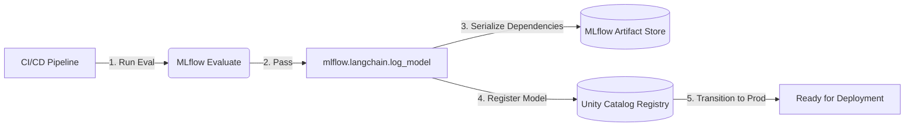

# Lesson 19: Model Registry & MLflow

We have built a secure, traced, and evaluated AI Agent. Currently, this agent lives as Python code (`graph.py`) on our laptops. We need to deploy it so the rest of the company can use it. The first step to deployment is Packaging and Registration.

## 1. Business Context

**Who requested this?**
The MLOps Team.

**Why?**
If multiple developers are editing the Agent's Python code or tweaking the prompt, how do we know which version is running in production? What if we deploy an update that breaks everything? We need a system to version control the *compiled* model, not just the code.

**Business Impact**
Seamless rollbacks and explicit lineage between a model in production and the code that generated it.

**Customer Problem**
"The AI was great yesterday, but today it's terrible. Which version is running?"

**ROI & Metrics**
*   **Deployment Safety:** Zero downtime during model upgrades. Rollback time < 1 minute.

---

## 2. Simple Analogy

*   **Git (Code Repo):** The recipe book where you write down how to bake the cake.
*   **Model Registry:** The glass display case in the bakery. You bake the cake (compile the Agent), put it in the display case, and label it "Chocolate Cake v1.0". The customer (User) only interacts with what is in the display case.

---

## 3. First Principles

*   **What:** A centralized repository that manages the full lifecycle of ML models, including versioning, stage transitions (Staging, Production, Archived), and annotations.
*   **Why:** Code is not a model. A GenAI model is code + configuration + prompts + tool definitions. The Registry bundles all this together.
*   **How:** Using Databricks Unity Catalog (UC) Model Registry.
*   **When:** After successful evaluation in CI/CD, before deployment.
*   **Tradeoffs:** Packaging a LangChain agent requires saving its dependencies (`pip_requirements`). If you register a model with conflicting dependencies, it won't load in production.
*   **Failure Scenarios:** "Dependency Hell." The model was trained using `langchain==0.1.0` but the serving endpoint is running `langchain==0.3.0`. The model crashes upon deployment.

---

## 4. Internal Working

1.  **Agent Compilation:** We take our `ShopSphereAgent` Python class.
2.  **MLflow Logging:** We call `mlflow.langchain.log_model(agent, "agent_model")`. MLflow serializes the Python objects, saves the prompt templates, and captures the exact library versions (e.g., `langchain`, `pydantic`) used in the environment.
3.  **UC Registration:** We register the logged model artifact into Unity Catalog: `catalog.schema.shopsphere_agent`.
4.  **Tagging:** We tag the model: `version=1`, `status=Production`.

---

## 5. Databricks Implementation

Historically, MLflow had a Workspace Model Registry. Databricks has recently migrated this into **Unity Catalog**. 
A registered model in UC behaves exactly like a Delta Table. You can run `GRANT EXECUTE ON MODEL shopsphere_dev.genai_core.shopsphere_agent TO 'serving_principals'`.

---

## 6. Production Code

We will create `src/llmops/registry.py` in the new directory.

*(See the actual file in your workspace for the code)*

---

## 7. Explain Every Line of Code

Looking at `src/llmops/registry.py`:
*   `mlflow.set_registry_uri("databricks-uc")`: This is CRITICAL. It tells MLflow to use the modern Unity Catalog registry instead of the legacy workspace registry.
*   `from mlflow.models import infer_signature`: A signature defines the expected input/output schema (e.g., "Expects a string, returns a string"). If a UI sends a JSON array instead of a string, MLflow catches the error before it hits your code.
*   `mlflow.langchain.log_model(...)`: Serializes the agent. 
*   `mlflow.register_model(...)`: Moves the logged artifact into Unity Catalog so it can be deployed to an endpoint.

---

## 8. Architecture Diagram

---

## 9. Production Problems

**The Problem: The Un-serializable Object**
You try to log your LangGraph agent, but MLflow throws a `PicklingError`.
*   **The Senior Solution:** LangChain components can sometimes hold active network connections (like a Databricks SQL Engine connection) which cannot be serialized to disk. You must create an `MLflow PyFunc Wrapper` class. This wrapper only initializes the connections *when the model is loaded into memory at inference time*, not when it is being logged to disk.

---

## 10. Design Decisions

**Why register a RAG Agent? Isn't it just an API caller?**
A standard LLM is just an API. But a RAG Agent contains logic: the chunk size it expects, the specific system prompt, the logic for handling tools. If you change the system prompt in your code but don't version the Agent in the registry, you have no way to instantly roll back if the new prompt causes hallucinations.

---

## 11. Cost Engineering

*   **Storage Cost:** Negligible. Saving a LangChain model artifact is usually just a few megabytes of YAML/Pickle files. (Unlike saving a 70B parameter model weights file, which is hundreds of GBs).

---

## 12. Interview Preparation (Senior Level)

1.  **System Design:** "Describe the lifecycle of an ML model from development to production using MLflow."
2.  **Architecture:** "Why is it important to use Unity Catalog for the Model Registry instead of a standalone MLflow server?" (Answer: Unified access control; you can tie the model directly to the datasets it was trained on via UC Lineage).
3.  **Debugging:** "You deploy a model from the registry, but the endpoint fails to start with a 'ModuleNotFoundError'. Why?" (Answer: The `pip_requirements` saved during `log_model` were incomplete or mismatched).
4.  **Coding:** "Write the Python code to log a LangChain agent to the MLflow Model Registry."

---

## 13. Resume Thinking

**How to talk about this project:**
*   **Bullet:** *Standardized LLMOps deployments by integrating LangGraph agents into the Databricks Unity Catalog Model Registry, enabling version control, dependency tracking, and sub-minute rollbacks.*
