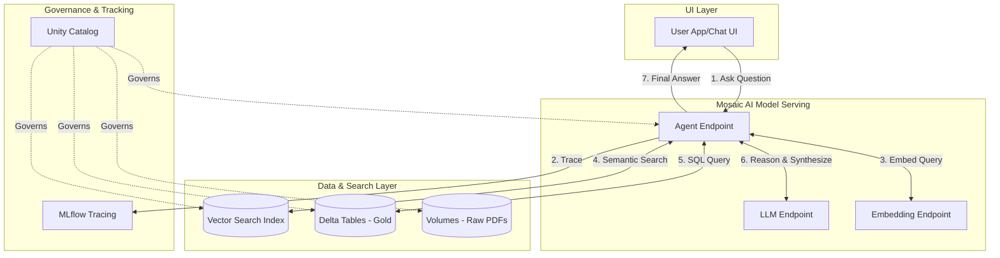

# Lesson 1: The Business Problem & Architecture Setup

Welcome to the AI Engineering Bootcamp. As a Staff Data Engineer moving into AI, your job is no longer just moving data from A to B. It’s about building intelligent systems on top of that data. We are building the **ShopSphere Retail Intelligence Platform**. 

## 1. Business Context

**Who requested this?**
The VP of Retail Operations and the Chief Marketing Officer.

**Why?**
Store managers and corporate analysts spend 40% of their time searching for information. They need to read PDF store guidelines, query SQL tables for inventory, and read text-based customer reviews to figure out why a product is failing in a specific region. 

**Business Impact**
Faster, data-driven decision making at the store level.

**Customer Problem**
"Siloed Data." A store manager asking *"Why did the new coffee machine sales drop in Store 42, and what are the return policies?"* currently needs to ask 3 different departments.

**ROI & Metrics**
*   **Time-to-Insight:** Reduce from an average of 2 days to < 10 seconds.
*   **Support Ticket Deflection:** Reduce internal operational support tickets by 30%.

---

## 2. Simple Analogy

Imagine you are managing a massive physical library. 

*   **Old Data Engineering (Data Warehouse):** You organize books into perfect shelves (tables) and give people a highly structured card catalog (SQL) to find exact facts. If they don't know SQL, they can't use the catalog.
*   **AI Engineering (GenAI Platform):** You hire a genius librarian (the AI Agent). The librarian has read every book (Embeddings/Vector Search), knows where the structured sales ledgers are (SQL tools), and can simply talk to the customer to give them a tailored answer.

---

## 3. First Principles

Before writing code, let's understand the core tenets of AI Engineering:

*   **What:** It is the integration of Generative Models (LLMs) with enterprise data and software engineering patterns.
*   **Why:** LLMs alone are just prediction engines. They hallucinate because they lack *your* proprietary context. AI Engineering provides that context.
*   **How:** Through Retrieval-Augmented Generation (RAG) and Agentic patterns. We fetch relevant context from our data platform and inject it into the LLM's prompt.
*   **When:** When the problem requires natural language understanding, synthesis, or reasoning over unstructured/semi-structured data.
*   **Where:** In our case, directly inside Databricks, where the data already lives, minimizing data movement and maximizing governance.
*   **Tradeoffs:** AI systems are non-deterministic. A SQL query always returns the same rows. An LLM might word the answer differently every time. We trade determinism for flexibility.
*   **Failure Scenarios:** The LLM hallucinates an answer, the context retrieval brings back the wrong documents, or the API call times out. 

---

## 4. Internal Working

How will a user's question flow through our platform?

1.  **User Input:** "Why did the coffee machine sales drop in Store 42?"
2.  **Orchestrator (Agent):** Receives the question. 
3.  **Intent Routing:** The Agent realizes it needs *both* structured data (sales) and unstructured data (reviews).
4.  **SQL Tool Execution:** Agent generates a SQL query to check `shopsphere_gold.sales_aggregated`.
5.  **Vector Search Execution:** Agent embeds the query "coffee machine complaints" and searches the Vector DB containing customer reviews and store guidelines.
6.  **Context Assembly:** Agent combines the SQL results (Sales dropped 40%) with Vector Search results (Reviews say the milk frother breaks).
7.  **LLM Synthesis:** The LLM reads the combined context and drafts a human-readable response.
8.  **Guardrails Check:** Output is checked to ensure no PII or inappropriate content is leaked.
9.  **Response:** User receives the final answer.

> [!IMPORTANT]
> Never hide the implementation details. Every "magic" AI feature is just a sequence of API calls, vector math, and string manipulation.

---

## 5. Databricks Implementation

We will use the Databricks Data Intelligence Platform for the entire stack.

*   **Unity Catalog (UC):** The backbone. It will govern not just our Delta tables, but our ML models, our Vector Indexes, and our AI Agent Tools (UC Functions).
*   **Databricks Volumes:** We will store raw PDFs (product manuals, guidelines) here. It's UC-governed cloud object storage.
*   **Delta Lake:** For structured data and parsed text chunks.
*   **Mosaic AI Vector Search:** A serverless vector database synced directly from our Delta tables.
*   **Mosaic AI Model Serving:** We will host our embeddings model, our LLM (e.g., Llama 3 or DBRX), and our final Agent as REST APIs here.
*   **MLflow:** For tracking experiments, tracing the agent's reasoning steps, and logging the models.
*   **Agent Bricks / LangChain:** The framework we use to write the orchestrator code.

---

## 6. Production Code

Let's set up the absolute foundation: a configuration-driven architecture. Notebooks are for exploration; enterprise systems use configuration files.

We will create `src/shopsphere_genai/config/core.py`. 

*(See the actual file in your workspace for the code)*

---

## 7. Explain Every Line of Code

Looking at `src/shopsphere_genai/config/core.py`:

*   `@dataclass(frozen=True)`: We use Python dataclasses to define our configuration. `frozen=True` makes it immutable. In production, you don't want configuration values changing at runtime accidentally.
*   `project_name: str`: A namespace for all our assets (tables, models, endpoints) so they don't collide with other teams.
*   `catalog_name: str` & `schema_name: str`: Defining exactly where in Unity Catalog our data lives.
*   `vector_search_endpoint_name: str`: The name of the serverless compute resource that will power our vector database.
*   `embedding_model_endpoint: str`: The model we will use to convert text into numbers (e.g., `databricks-bge-large-en`).
*   `llm_endpoint: str`: The model we will use for reasoning and generation (e.g., `databricks-meta-llama-3-70b-instruct`).
*   `@classmethod def from_env()`: A factory method. In an enterprise, you don't hardcode "dev" or "prod" catalog names. You read them from environment variables injected by your CI/CD pipeline (GitHub Actions or Databricks Asset Bundles).

---

## 8. Architecture Diagram

---

## 9. Production Problems

**The Problem: Scope Creep & "Frankenstein" Architecture**
Junior teams often duct-tape together 5 different SaaS tools (e.g., Snowflake for SQL, Pinecone for Vectors, OpenAI for LLMs, LangSmith for tracing, AWS API Gateway for serving). 
*   **The Failure:** When a query fails, where did it fail? How do you govern access to Pinecone when your permissions are in Snowflake? How do you trace a request across 4 clouds?
*   **The Senior Solution:** Platform consolidation. By using Databricks for everything (Delta, Vector Search, MLflow, Serving, UC), we have a single pane of glass for security (Unity Catalog) and observability (Lakehouse Monitoring).

---

## 10. Design Decisions

**Why not Snowflake Cortex + Pinecone?**
*   *Tradeoff:* Snowflake Cortex is excellent for SQL-native LLM calls. However, integrating it with external vector databases like Pinecone introduces data egress costs, synchronisation lag, and a fragmented security model. 
*   *Why Databricks:* With Databricks, Vector Search natively synchronises with Delta Tables without writing complex ETL pipelines. Unity Catalog governs both the table and the index. 

---

## 11. Cost Engineering

For Phase 1 & 2 (Building the RAG foundation):
*   **Storage (Delta/Volumes):** Negligible. Pennies per GB on cloud object storage.
*   **Compute (Data Prep):** We will use ephemeral job clusters. Very cheap.
*   **Vector Search Endpoint:** This is a persistent serverless resource. It will cost money (approx. $0.70 - $1.50 per hour depending on size) because it needs to stay in memory for low-latency retrieval. *Optimization:* For dev, scale it down to zero when not in use.
*   **LLM Inference (Tokens):** Databricks Foundation Model APIs charge per million tokens. BGE-large embeddings are very cheap. Llama 3 70B is moderate. *Optimization:* Aggressive chunking so we don't send useless context to the LLM.

---

## 12. Enterprise Constraints

**Requirement:** GDPR and PII compliance.
*   **Redesign impact:** We cannot randomly send customer data to public APIs (like the public OpenAI endpoint). We must use secure, dedicated endpoints. By using Databricks Serving endpoints, the data never leaves our VPC/Cloud account boundary. Unity Catalog ensures that only the Agent's service principal can read the raw PII data.

---

## 13. Architecture Review (Principal Engineer Defense)

**Principal:** "Why are you using LangChain for the agent orchestrator? It's notoriously bloated."
**You:** "That's a fair point. LangChain can be overly abstracted. However, we are using it purely for standardizing our Tool interfaces and state management. In a later phase, if performance becomes an issue, we will migrate the core orchestration to a lighter framework like `Agent Bricks` or pure Python functions calling the Databricks SDK. For now, the integration with MLflow's tracing for LangChain is too valuable for rapid prototyping."

---

## 14. Refactoring Journey

*   **Version 1 (Notebooks):** You will see many tutorials where people write a giant script in a Databricks Notebook. It's un-testable and un-deployable.
*   **Version 2 (Our Approach):** We start immediately with OOP (Object-Oriented Programming) and configuration files. We are building a Python package that can be tested locally and deployed via CI/CD. 

---

## 15. Interview Preparation (Senior Level)

1.  **Architecture:** "Draw an architecture for an enterprise RAG system that processes both structured sales data and unstructured PDF manuals. How do you ensure data consistency?"
2.  **System Design:** "How would you handle a scenario where your vector database goes down but your SQL database is still up?"
3.  **Governance:** "Explain how you would implement Row-Level Security in a RAG application where the LLM should only see documents the requesting user is allowed to see."
4.  **Cost:** "Your LLM token costs have spiked by 500% in a week. Walk me through your debugging steps."
5.  **Coding:** "Design a Python class that acts as an interface for swapping out different embedding models without changing the core application logic."

---

## 16. Resume Thinking

**How to talk about this project (so far):**
*   **Bullet:** *Designed an end-to-end Generative AI platform architecture unifying structured Data Lakehouse assets and unstructured vector search, governed entirely by Unity Catalog.*
*   **STAR Story:** "Situation: Our analysts were spending days silo-hopping to answer basic questions. Task: Design an AI platform to unify this. Action: I architected a unified system on Databricks using Delta, Vector Search, and Model Serving, utilizing a configuration-driven codebase rather than notebooks. Result: Laid the foundation for an agentic system with a unified security model (Unity Catalog), paving the way for sub-10 second query times."
