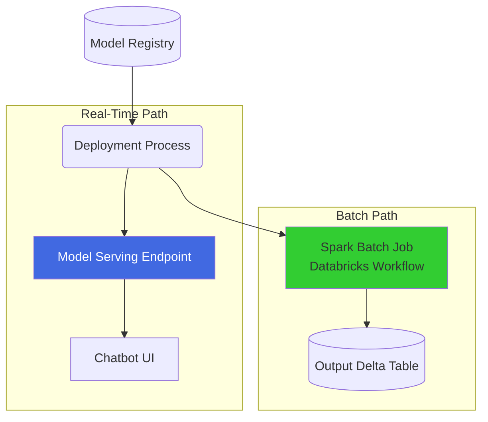

# Lesson 20: Batch vs. Real-Time Serving

Our Agent is registered in Unity Catalog. Now we need to expose it so users can interact with it. There are two fundamentally different ways to serve an AI model: Batch (Offline) and Real-Time (Online). 

## 1. Business Context

**Who requested this?**
The Application Architecture Team.

**Why?**
The frontend team needs a REST API they can call from the Chat UI (Real-Time). Conversely, the marketing team wants to use the Agent to summarize 50,000 customer reviews every night (Batch).

**Business Impact**
Deploying the model in the correct mode dictates the infrastructure cost. Real-time is expensive. Batch is cheap.

**Customer Problem**
"The marketing team tried to run 50,000 summaries through the real-time chat endpoint, and it crashed the system and cost $1,000."

**ROI & Metrics**
*   **Infrastructure Efficiency:** Route high-volume, asynchronous traffic to Batch endpoints to reduce compute costs by 80%.

---

## 2. Simple Analogy

*   **Real-Time Serving:** A drive-thru window. The customer pulls up, asks a question, and the cook immediately makes the food while the customer waits. It requires the cook (GPU/CPU) to be standing there 24/7.
*   **Batch Serving:** A catering order. The customer drops off a list of 500 meals they need by tomorrow. The kitchen processes it overnight using mass-production techniques, which is much cheaper and more efficient.

---

## 3. First Principles

*   **What:** The method of executing model inference.
*   **Why:** To match the latency and throughput requirements of the consumer.
*   **How:** Databricks Model Serving (Real-Time) vs. Databricks Workflows with `spark.read` (Batch).
*   **When:** 
    *   *Real-Time:* Chatbots, dynamic email drafting, search bars.
    *   *Batch:* Nightly report generation, bulk translation, semantic metadata tagging.
*   **Tradeoffs:** Real-time requires persistent compute (paying for a cluster even when nobody is querying it). Batch compute is ephemeral (pay only for the exact seconds the cluster is running).
*   **Failure Scenarios:** "Thundering Herd." A sudden spike in real-time traffic overwhelms the serving endpoint because it didn't autoscale fast enough.

---

## 4. Internal Working

**Real-Time (Model Serving):**
1.  Databricks provisions a Docker container with the required Python environment.
2.  It loads the Agent from Unity Catalog into memory (via FastAPI/Flask under the hood).
3.  It exposes a secure REST API endpoint.
4.  It autoscales the number of containers based on QPS (Queries Per Second).

**Batch (Spark UDF):**
1.  A Databricks Job cluster spins up.
2.  It loads the Agent from UC and broadcasts it to all worker nodes.
3.  Spark reads a Delta table with 50,000 questions.
4.  Spark applies the Agent as a UDF across all nodes simultaneously.
5.  Results are written back to a new Delta table. Cluster shuts down.

---

## 5. Databricks Implementation

We will use the Databricks Python SDK to provision a **Model Serving Endpoint**. 
This endpoint provides an OpenAI-compatible REST API, meaning frontend developers can use standard OpenAI javascript libraries to talk to your custom LangGraph agent.

---

## 6. Production Code

We will create `src/llmops/deploy.py` in the new directory.

*(See the actual file in your workspace for the code)*

---

## 7. Explain Every Line of Code

Looking at `src/llmops/deploy.py`:
*   `from databricks.sdk import WorkspaceClient`: The modern way to interact with Databricks infrastructure.
*   `endpoint_name = "shopsphere_agent_prod"`: The URL path for the REST API.
*   `ServedEntityInput(...)`: We define what goes into the endpoint. We point it to the exact version of the model we registered in Lesson 19 (`entity_name=self.model_name`, `entity_version=version`).
*   `workload_size="Small"`: Determines the compute size (CPU/RAM) of the container. LangGraph agents usually don't need GPUs if they are calling external LLM APIs, but they *do* need memory.
*   `scale_to_zero_enabled=True`: **Cost saving feature.** If no one queries the bot at 3 AM, the endpoint scales to 0 containers, saving money. Note: This introduces a "Cold Start" latency for the first user of the morning.

---

## 8. Architecture Diagram

---

## 9. Production Problems

**The Problem: State in Real-Time Serving**
You deploy an agent that relies on a local Python dictionary for memory. Two users hit the endpoint simultaneously. User A's data overwrites User B's data because they hit the same load-balanced container.
*   **The Senior Solution:** Model Serving endpoints must be 100% stateless. Memory must be written to an external database (like our Delta table from Lesson 12). The incoming request must provide the `session_id`.

---

## 10. Design Decisions

**Ray Serve vs Databricks Model Serving**
Ray Serve is excellent for complex, multi-model orchestration on Kubernetes. However, the operational overhead is massive. Databricks Model Serving abstracts away the Kubernetes cluster, the load balancer, the autoscale logic, and the authentication layer. For 95% of enterprise AI use cases, managed Serverless endpoints are superior to self-managed Ray clusters.

---

## 11. Cost Engineering

*   **Concurrency Limits:** If you use a "Small" endpoint, it might only handle 4 concurrent requests. The 5th request will queue. If it queues too long, the UI times out. 
*   **Optimization:** Load test your endpoint using a tool like `locust` before deployment to find the breaking point, then set your `workload_size` accordingly.

---

## 12. Interview Preparation (Senior Level)

1.  **Architecture:** "Explain the architectural differences between deploying a model for batch inference vs real-time inference."
2.  **System Design:** "How do you handle 'Cold Starts' in a serverless Model Serving architecture?" (Answer: Provisioned concurrency or warmup cron jobs).
3.  **Tradeoffs:** "What are the pros and cons of enabling `scale_to_zero` on an LLM endpoint?"
4.  **Coding:** "Write a Python script using the Databricks SDK to update an existing Model Serving endpoint to a new model version."

---

## 13. Resume Thinking

**How to talk about this project:**
*   **Bullet:** *Automated the deployment of LangGraph agents to Databricks Serverless Model Serving, configuring auto-scaling and scale-to-zero capabilities to balance sub-second latency requirements with infrastructure cost optimization.*
