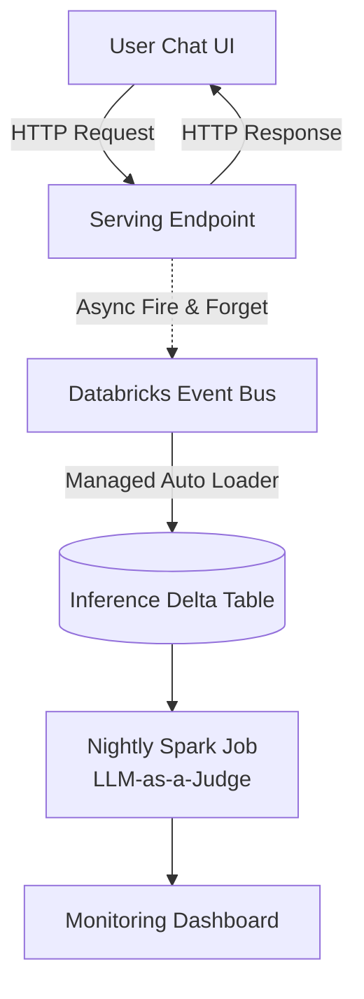

# Lesson 21: Online Monitoring (Inference Tables)

The model is deployed. Users are chatting with it. Now what?
In traditional ML, models suffer from "Data Drift" (the real world changes, making the model's math wrong). In Generative AI, we suffer from "Concept Drift", "Toxicity", and "Hallucinations". We need to monitor this live.

## 1. Business Context

**Who requested this?**
Data Science & Product Analytics.

**Why?**
They need to know if the bot is actually helpful. If 80% of users are giving a "Thumbs Down" to the bot's answers, the DS team needs to find those specific conversations, analyze them, and update the Golden Dataset for the next version.

**Business Impact**
Closes the data flywheel loop. Production failures become training data for the next iteration.

**Customer Problem**
"Users are abandoning the chat UI. We have no idea what questions they are asking that the bot is failing to answer."

**ROI & Metrics**
*   **Continuous Improvement:** Automatically capture 100% of production interactions into a queryable Delta Table.

---

## 2. Simple Analogy

*   **No Monitoring:** Running a retail store without a receipt system or inventory tracker. At the end of the month, you know you made money, but you have no idea what people bought or what was stolen.
*   **Inference Tables:** A cashier scanning every single item. You know exactly who bought what, at what time, and for how much.

---

## 3. First Principles

*   **What:** Automatically logging every HTTP Request (User Query) and HTTP Response (AI Answer) that hits the Serving Endpoint into a Delta Table.
*   **Why:** To perform offline analysis, LLM-as-a-Judge evaluations on live traffic, and user behavior analytics.
*   **How:** Using Databricks Inference Tables.
*   **When:** Enable this immediately upon creating a production serving endpoint.
*   **Tradeoffs:** Storage costs. If you have a high-volume endpoint, the Inference Table will grow to terabytes quickly. PII compliance is also a major risk here (users pasting credit cards into the chat).
*   **Failure Scenarios:** "Schema Evolution." The frontend team changes the JSON payload they send to the endpoint. The Inference Table breaks because the incoming JSON no longer matches the Delta table schema.

---

## 4. Internal Working

1.  **User Request:** Sends `{"messages": ["Hello"]}` to the Endpoint.
2.  **Endpoint:** Generates `{"response": "Hi!"}`.
3.  **Asynchronous Logging:** The Databricks Serving infrastructure *in the background* writes a JSON string of the request and response to a hidden storage bucket.
4.  **Auto Loader:** A Databricks managed background job runs periodically, picks up the raw JSON, and appends it to a structured Unity Catalog Delta Table (`shopsphere_prod.monitoring.inference_logs`).

---

## 5. Databricks Implementation

In Databricks, enabling Inference Tables is literally a boolean toggle when you create or update the endpoint via the UI or the SDK. Databricks handles the complex Kafka/EventHub plumbing behind the scenes.

---

## 6. Production Code

We will create `src/llmops/monitor.py` in the new directory.

*(See the actual file in your workspace for the code)*

---

## 7. Explain Every Line of Code

Looking at `src/llmops/monitor.py`:
*   `auto_capture_config`: The SDK payload to enable the feature.
*   `catalog_name="shopsphere_prod"`: The destination catalog.
*   `schema_name="monitoring"`: The destination schema. Databricks will auto-create the table here.
*   `table_name_prefix="agent_logs"`: The table will be named `agent_logs_<endpoint_name>`.
*   `def run_nightly_judge_job()`: Demonstrates the actual *value* of the Inference Table. Just collecting data is useless. This function shows how a nightly Spark job reads yesterday's logs and runs `mlflow.evaluate()` with an LLM-as-a-Judge to score the live production traffic for toxicity and correctness.

---

## 8. Architecture Diagram

---

## 9. Production Problems

**The Problem: The "Thumbs Down" Feedback**
The UI has a thumbs down button. How do you link that click in the UI to the specific row in the Inference Table?
*   **The Senior Solution:** `client_request_id`. The frontend MUST generate a unique UUID for every request and pass it in the HTTP Header or JSON payload. The Inference Table logs this UUID. When the user clicks "Thumbs Down", the frontend sends an API call with that same UUID to a feedback table. A Databricks SQL view then `JOIN`s the Inference Table and the Feedback Table on the UUID.

---

## 10. Design Decisions

**Why not just log to Delta inside the Agent's Python code?**
You *could* add `spark.write...` inside the Agent. But:
1.  It adds latency to the user's chat response.
2.  If the Delta write fails, the whole chat fails.
3.  If the Agent crashes before it finishes, you lose the log of the crash.
Inference Tables happen at the infrastructure layer (Nginx proxy layer), ensuring 100% capture with zero latency penalty to the user.

---

## 11. Cost Engineering

*   **Query Costs:** Running a `SELECT *` on a massive Inference Table to build a dashboard will be expensive if not partitioned.
*   **Optimization:** Ensure the Inference Table is heavily partitioned by `date_utc`. Your monitoring dashboards should always include a `WHERE date_utc = current_date()` clause to prune partitions.

---

## 12. Interview Preparation (Senior Level)

1.  **Architecture:** "Explain the data flow of capturing production LLM traffic and using it to improve the model."
2.  **System Design:** "How do you associate asynchronous user feedback (e.g., clicking a 5-star rating) with the exact prompt and response generated by the LLM?" (Answer: Client-side generated correlation IDs).
3.  **Tradeoffs:** "What is the architectural tradeoff of application-level logging vs infrastructure-level inference tables?"
4.  **Coding:** "Write a Spark SQL query that analyzes an inference table to find the top 10 most common topics users asked about yesterday."

---

## 13. Resume Thinking

**How to talk about this project:**
*   **Bullet:** *Engineered a continuous feedback loop using Databricks Inference Tables and scheduled LLM-as-a-Judge Spark jobs, enabling automated daily monitoring of production RAG toxicity, hallucination rates, and user sentiment.*
