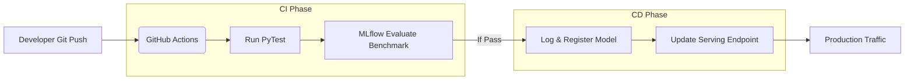

# Lesson 22: CI/CD & LLMOps Platform

We have manually run scripts to build, evaluate, and deploy our Agent. In a production Enterprise environment, a human engineer should *never* deploy a model from their laptop. We need a pipeline.

## 1. Business Context

**Who requested this?**
The VP of Engineering.

**Why?**
Manual deployments cause outages. We need a rigorous, automated pipeline that enforces peer review (Pull Requests) and automated testing before code reaches production.

**Business Impact**
Increases deployment velocity from 1 release per month to 10 releases per day, while reducing production incidents.

**Customer Problem**
"The lead engineer went on vacation, and nobody else knows the 15 manual steps required to deploy the AI model."

**ROI & Metrics**
*   **Deployment Frequency:** Fully automated pipeline from Git push to Production endpoint.

---

## 2. Simple Analogy

*   **Manual Deployment:** Building a custom car by hand in your garage. If you make a mistake, you don't find out until you drive it on the highway.
*   **CI/CD Pipeline:** A Ford assembly line. The car passes through 50 automated robotic checks (CI) before it is finally driven off the lot (CD).

---

## 3. First Principles

*   **What:** Continuous Integration (CI) and Continuous Deployment (CD) applied to Generative AI.
*   **Why:** To ensure that changes to code, prompts, or tool definitions do not degrade the Agent's performance.
*   **How:** Using GitHub Actions (or GitLab/Azure DevOps) combined with Databricks Asset Bundles (DABs).
*   **When:** Triggers automatically whenever a developer pushes code or merges a Pull Request.
*   **Tradeoffs:** High initial setup cost. Building a bulletproof CI/CD pipeline takes weeks of DevOps engineering time.
*   **Failure Scenarios:** "The Flaky Test." The automated LLM-as-a-Judge randomly fails 10% of the time because the Judge LLM is non-deterministic, blocking developers from merging good code.

---

## 4. Internal Working

1.  **Dev Phase:** Engineer changes the system prompt in `agent.py` and pushes to the `feature-branch` on GitHub.
2.  **Continuous Integration (CI):**
    *   GitHub Actions spins up a Databricks Job.
    *   Runs Unit Tests (`pytest`).
    *   Runs the LLM-as-a-Judge Evaluation (Lesson 15/16) against the *Dev* dataset.
    *   If Score > 90%, the PR is allowed to merge.
3.  **Continuous Deployment (CD):**
    *   PR merges to `main`.
    *   GitHub Actions triggers the deployment script (Lesson 20).
    *   Databricks Model Serving performs a zero-downtime update to the new version.

---

## 5. Databricks Implementation

**Databricks Asset Bundles (DABs)** are the modern standard. 
Instead of writing complex API calls, you define your entire AI project (Jobs, Models, Endpoints) in a simple `databricks.yml` file. When GitHub Actions runs `databricks bundle deploy`, it reads the YAML and automatically syncs your production workspace to match the code.

---

## 6. Production Code

We will create `.github/workflows/llmops.yml` in the new directory.
*(Note: Because of the directory structure requested, we will place it in `F:\databricks\databricks aws pracrice\databricks ai practice\github_workflow.yml` for visibility)*

*(See the actual file in your workspace for the code)*

---

## 7. Explain Every Line of Code

Looking at `github_workflow.yml`:
*   `on: push: branches: [ main ]`: The trigger. This runs automatically when code is merged to main.
*   `databricks/setup-cli@v0.211.0`: Official Databricks action to install the CLI on the GitHub runner.
*   `DATABRICKS_HOST` & `DATABRICKS_TOKEN`: Secrets securely passed into the pipeline.
*   `run: python src/evaluation/evaluator.py`: The CI step. If the evaluator throws an error or the score drops below a threshold, the script exits with `code 1`, which fails the entire GitHub Action and stops the deployment.
*   `run: python src/llmops/deploy.py`: The CD step. Only executes if the evaluation passes.

---

## 8. Architecture Diagram

---

## 9. Production Problems

**The Problem: Code vs Data drift**
Your CI/CD pipeline deploys a perfectly tested Agent. But the next day, a data engineer changes the schema of the Delta table your Agent searches. The Agent crashes, but your CI/CD pipeline is green because the *code* didn't change.
*   **The Senior Solution:** **Data Contracts & Data CI/CD.** You must implement a separate pipeline that tests the data pipeline (DLT). Furthermore, your Agent's CI/CD must run integration tests against the *live* staging tables, not just static mock data.

---

## 10. Design Decisions

**Bundle YAML vs Python SDK**
In Lesson 20, we used the Python SDK to deploy the endpoint. That is great for learning. In a true enterprise, you use Databricks Asset Bundles (`databricks.yml`). Bundles are declarative (like Terraform). You declare "I want an endpoint named X with model version Y", and Databricks figures out the API calls to make it happen. 
*Decision:* We taught the SDK first to show the mechanics, but the CI/CD pipeline ultimately executes the Bundle deployment.

---

## 11. Cost Engineering

*   **CI Compute Costs:** Running a full 1,000-question LLM benchmark on every single git commit will burn thousands of dollars a month in API tokens.
*   **Optimization:** Implement "Tiered Testing". Run a fast, 10-question smoke test on every PR commit. Only run the expensive 1,000-question benchmark when merging to the `main` branch.

---

## 12. Interview Preparation (Senior Level)

1.  **Architecture:** "Explain the end-to-end lifecycle of an LLM application from a developer's laptop to a production serving endpoint."
2.  **System Design:** "How do you handle the non-deterministic nature of LLMs in a CI/CD pipeline that requires pass/fail criteria?" (Answer: Use statistical thresholds. E.g., 'Accuracy must be > 85%', rather than 'Must pass 100% of tests').
3.  **Tradeoffs:** "Why shouldn't developers have write access to the Production Databricks Workspace?" (Answer: To enforce the CI/CD process and maintain compliance/audit trails).
4.  **Coding:** "Write a GitHub Actions YAML step to execute a Databricks Job."

---

## 13. Resume Thinking

**How to talk about this project:**
*   **Bullet:** *Designed and implemented a fully automated LLMOps CI/CD pipeline using GitHub Actions, enforcing rigorous LLM-as-a-Judge evaluations before executing zero-downtime deployments to Databricks Serverless compute.*
