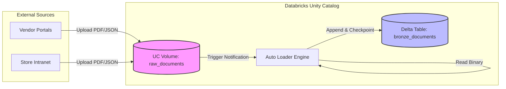

# Lesson 2: Multi-format Document Ingestion

We have our architecture laid out. Now we need data. Our goal is to ingest store guidelines (PDFs), product metadata (JSON), and sales receipts (CSV) into our Bronze layer.

## 1. Business Context

**Who requested this?**
Data Engineering Lead & Data Governance Officer.

**Why?**
The company receives 1,000+ new PDF manuals and JSON product updates every day from various manufacturers. Currently, these sit in isolated AWS S3 buckets or Google Cloud Storage without governance, making it impossible for an AI to reliably search them.

**Business Impact**
A centralized, governed repository of all enterprise knowledge that updates automatically.

**Customer Problem**
"We lost the new espresso machine manual because it was emailed to a store manager."

**ROI & Metrics**
*   **Data Freshness:** Reduce unstructured data ingestion lag from 1 week to near real-time (streaming).

---

## 2. Simple Analogy

Think of a bustling corporate mailroom.
Packages of all shapes and sizes (PDFs, JSON, CSVs) arrive constantly. If you just throw them in a pile (Data Swamp), nobody can find anything. 
Instead, you hire a mailroom clerk (Auto Loader). The clerk keeps a ledger (RocksDB State Store) of every package received. Even if the mailroom loses power, the clerk knows exactly which packages haven't been opened yet when the lights come back on.

---

## 3. First Principles

*   **What:** Ingesting files continuously and incrementally.
*   **Why:** Re-reading the entire folder of PDFs every day is prohibitively expensive and slow. We only want to process *new* or *updated* files.
*   **How:** Streaming ingestion using checkpointing.
*   **When:** The very first step of the Medallion Architecture (Raw to Bronze).
*   **Tradeoffs:** Streaming requires a state store. If the state store gets corrupted, you might need to re-process data. However, the cost savings over batch re-processing are massive.
*   **Failure Scenarios:** A malformed file crashes the stream. A schema change in a JSON file breaks the table schema.

---

## 4. Internal Working

How does incremental ingestion actually work under the hood?

1.  **File Drops:** A new PDF is dropped into a Unity Catalog Volume.
2.  **Notification/Listing:** Databricks Auto Loader either lists the directory or receives a cloud notification (e.g., AWS SQS or Event Grid) that a new file arrived.
3.  **RocksDB Ledger:** It checks its internal RocksDB state store (checkpoint location). "Have I seen `espresso_manual_v2.pdf` before?"
4.  **Processing:** If no, it reads the raw binary of the file.
5.  **Commit:** It writes the binary data to a Delta Table and updates the RocksDB ledger simultaneously.

---

## 5. Databricks Implementation

*   **Unity Catalog Volumes:** Volumes are the Databricks way to manage non-tabular data (like PDFs). They provide a standard path (`/Volumes/catalog/schema/volume_name/file.pdf`) governed by Unity Catalog RBAC.
*   **Databricks Auto Loader (`cloudFiles`):** The engine for streaming file ingestion. It's built on top of Apache Spark Structured Streaming but optimized for cloud object storage.
*   **Delta Lake (Bronze):** We will store the *raw binary content* of the PDFs in a Delta table. Why? Because Delta gives us ACID transactions and time travel.

---

## 6. Production Code

We will write `src/shopsphere_genai/ingestion/loader.py`. This class will encapsulate the Auto Loader logic.

*(See the actual file in your workspace for the code)*

---

## 7. Explain Every Line of Code

Looking at `src/shopsphere_genai/ingestion/loader.py`:

*   `class DocumentIngestor`: We use a class to encapsulate state (the Spark session and config).
*   `spark.readStream.format("cloudFiles")`: This tells Spark to use Databricks Auto Loader instead of the standard Spark file reader.
*   `.option("cloudFiles.format", "binaryFile")`: We are telling Auto Loader to read the files as raw binary data. This is crucial for PDFs and images. It will load the file path, the modification time, the length, and the binary content.
*   `.option("cloudFiles.useNotifications", "true")`: For massive directories, listing files is slow. This tells Databricks to automatically set up cloud-native notifications (like AWS SQS) behind the scenes to track new files.
*   `.withColumn("ingestion_timestamp", current_timestamp())`: We add audit metadata. Every enterprise table must have an ingestion timestamp.
*   `writeStream...`: We write the stream to our Delta table.
*   `.option("checkpointLocation", ...)`: **The most important line.** This is the RocksDB ledger. Without this, the stream cannot recover from failure.

---

## 8. Architecture Diagram

---

## 9. Production Problems

**The Problem: Schema Evolution in JSON Files**
If we were ingesting JSON instead of binary PDFs, a common problem is schema drift. A vendor suddenly adds a `warranty_period` column. Standard Spark streaming crashes.
*   **The Senior Solution:** Auto Loader handles this gracefully using Schema Evolution. We would add `.option("cloudFiles.schemaEvolutionMode", "addNewColumns")`. Databricks automatically alters the Delta table schema without dropping the stream.

**The Problem: Corrupted PDFs**
A zero-byte file or a corrupted PDF crashes the parser later downstream.
*   **The Senior Solution:** We store the raw binary *first* in Bronze. If parsing fails in Silver, we still have the original file in Bronze. We never lose data.

---

## 10. Design Decisions

**Why Auto Loader vs Standard `spark.readStream`?**
Standard Spark streaming uses file listing (calling `ls` on the S3 bucket). As the bucket grows to millions of files, listing takes longer than processing. Auto Loader uses cloud notifications, making ingestion time constant regardless of bucket size.

**Why store PDFs in a Bronze Delta Table instead of just leaving them in the Volume?**
1.  **Metadata:** We can easily add columns like `ingested_at`, `source_system`, and `file_hash`.
2.  **Performance:** Reading thousands of small files is slow. Delta Lake compacts the binary data into larger Parquet files, making downstream parsing much faster.

---

## 11. Cost Engineering

*   **Job Clusters vs All-Purpose:** Streaming ingestion should ALWAYS run on Job Compute, which is significantly cheaper than All-Purpose compute.
*   **Trigger Once:** For cost efficiency in non-critical systems, instead of running the stream 24/7, we can use `.trigger(availableNow=True)`. This wakes up the cluster, processes everything in the queue, and shuts down. It combines the cost-efficiency of batch with the state-management of streaming.

---

## 12. Enterprise Constraints

**Requirement:** High Availability (99.99%).
*   **Redesign impact:** If the cluster dies, the pipeline stops. By using Delta Live Tables (DLT) or Databricks Workflows with retries, the system automatically respins the cluster. The checkpoint ensures no data is missed or duplicated upon restart.

---

## 13. Architecture Review (Principal Engineer Defense)

**Principal:** "Storing binary PDFs inside a Delta Table Parquet file seems like an anti-pattern. Parquet is for columnar data."
**You:** "Historically, yes. However, modern Databricks runtimes handle `binaryType` columns very efficiently. By bringing the raw binary into Delta, we gain ACID transactions, time travel, and the ability to process the data using distributed PySpark UDFs in the next step. If the files were consistently over 100MB, I would agree, but for 2MB manuals, the performance gain of distributed processing outweighs the storage overhead."

---

## 14. Refactoring Journey

*   **Version 1:** `spark.read.format("binaryFile").load("/Volumes/...")` -> A basic batch read. Fails at scale.
*   **Version 2:** `spark.readStream.format("cloudFiles")` -> Adds Auto Loader for incremental processing.
*   **Version 3 (Our Code):** Encapsulated in an OOP class with proper checkpoints, schema management, and environment variables.

---

## 15. Interview Preparation (Senior Level)

1.  **Architecture:** "How do you handle incrementally ingesting millions of unstructured files into a data lakehouse?"
2.  **Debugging:** "Your Auto Loader stream is failing with a RocksDB state store error. How do you recover without losing data?"
3.  **System Design:** "Design a pipeline that ingests data continuously but only costs $50 a month." (Answer: `Trigger.AvailableNow`)
4.  **Tradeoffs:** "Compare standard Spark Streaming file source vs Databricks Auto Loader."
5.  **Coding:** "Write the PySpark code to read binary files using Auto Loader."

---

## 16. Resume Thinking

**How to talk about this project:**
*   **Bullet:** *Architected an incremental, fault-tolerant ingestion pipeline utilizing Databricks Auto Loader to process high-velocity unstructured enterprise documents into a Delta Lake Bronze layer.*
*   **Business Impact:** Reduced data ingestion latency from weekly batches to near real-time, eliminating the "stale context" problem for downstream AI models.
