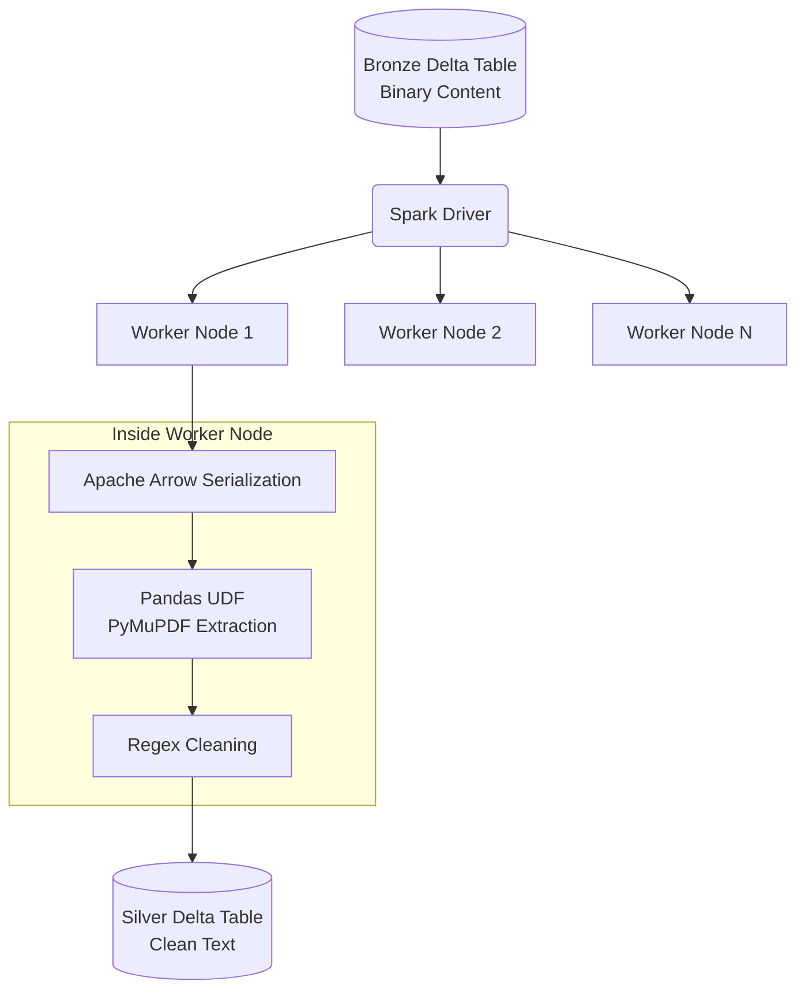

# Lesson 3: Parsing & Cleaning at Scale

We have a Bronze Delta table filling up with raw binary files (PDFs) thanks to our Auto Loader stream. Now we need to extract the text from them and move it to our Silver layer.

## 1. Business Context

**Who requested this?**
AI Research Team & Data Quality Engineers.

**Why?**
The raw binary blob is useless to an LLM. We need raw text. However, parsing a 100-page PDF takes 5 seconds on a single CPU. If we have 1,000,000 PDFs, doing this sequentially (e.g., in a simple Python script) would take nearly two months.

**Business Impact**
Scalable, distributed extraction means the entire company's history of manuals can be processed over a weekend.

**Customer Problem**
"The AI is answering with garbage because the text it's reading includes page numbers, headers, footers, and corrupted characters."

**ROI & Metrics**
*   **Data Processing Speed:** 100x improvement via distributed Spark computing.
*   **Data Quality:** Clean, markdown-formatted text yields a 20% improvement in Retrieval Accuracy (NDCG).

---

## 2. Simple Analogy

Imagine you bought a warehouse full of locked safes (binary files in Bronze). 
*   **Single-node Python (Junior):** You hire one expert safe-cracker. He goes from safe to safe. It takes years.
*   **Apache Spark (Senior):** You hire 1,000 safe-crackers (Worker Nodes). The manager (Driver Node) assigns each cracker a row of safes. They all open them simultaneously.

---

## 3. First Principles

*   **What:** Distributed Text Extraction using PySpark User-Defined Functions (UDFs).
*   **Why:** To leverage the massive horizontal scaling capabilities of Databricks clusters.
*   **How:** We wrap a standard Python library (like `PyMuPDF` or `pdfplumber`) inside a Pandas UDF.
*   **When:** The Bronze-to-Silver transition in the Medallion Architecture.
*   **Tradeoffs:** UDFs introduce serialization overhead (moving data between the JVM and Python). Using *Pandas UDFs* minimizes this overhead using Apache Arrow.
*   **Failure Scenarios:** A PDF is password protected, malformed, or an image (requiring OCR). If not handled with try/except, one bad PDF crashes the entire executor node.

---

## 4. Internal Working

1.  **Read Bronze:** Spark reads the Bronze Delta table (which contains the `content` column of binary data).
2.  **Partitioning:** Spark splits the rows across multiple worker nodes.
3.  **Arrow Vectorization:** Spark batches the binary data and sends it to the Python runtime on the worker via Apache Arrow.
4.  **UDF Execution:** The Pandas UDF executes `extract_text_from_bytes(batch)`.
5.  **Cleaning:** Regex patterns remove headers, footers, and null characters.
6.  **Write Silver:** The clean text is written to the Silver Delta table.

---

## 5. Databricks Implementation

*   **Pandas UDFs (`@pandas_udf`):** Essential for high-performance Python code in PySpark. 
*   **Delta Lake (Silver):** We will store the extracted text here. We will also add metadata columns like `page_count` or `extraction_error_flag`.
*   *(Alternative: Databricks provides built-in `ai_extract` functions in preview, but understanding the UDF approach is mandatory for custom logic and interviews).*

---

## 6. Production Code

We will write `src/shopsphere_genai/ingestion/parser.py`.

*(See the actual file in your workspace for the code)*

---

## 7. Explain Every Line of Code

Looking at `src/shopsphere_genai/ingestion/parser.py`:

*   `@pandas_udf(StringType())`: This decorator tells Spark, "This function takes a Pandas Series, operates on it, and returns a Pandas Series of Strings." 
*   `def extract_pdf_text_udf(content_series: pd.Series) -> pd.Series:` The signature for a Pandas UDF.
*   `for content in content_series:` We iterate through the batch of binary files assigned to this specific worker core.
*   `try...except Exception as e:` **CRITICAL.** If you don't catch exceptions in a UDF, one corrupted PDF will kill the entire Spark Job. We log the error in the returned string so it can be filtered later.
*   `fitz.open(stream=content, filetype="pdf")`: We use `PyMuPDF` (fitz) to read the binary stream from memory. We do *not* write it to disk first (which would cause massive disk I/O bottlenecks).
*   `re.sub(r'\s+', ' ', text).strip()`: A basic cleaning step to remove excessive whitespace and newlines, which waste LLM tokens later.
*   `.withColumn("cleaned_text", extract_pdf_text_udf(col("content")))`: Applying the UDF across the massive distributed dataframe.

---

## 8. Architecture Diagram

---

## 9. Production Problems

**The Problem: Image-Only PDFs**
Many manuals are just scanned images. `PyMuPDF` will return an empty string because there is no text layer.
*   **The Senior Solution:** In the UDF, if `len(extracted_text) < 50`, we branch the logic to use OCR (e.g., `pytesseract` or an external API). For this Bootcamp, we keep it simple, but in production, we'd flag the row as `needs_ocr = True` and process it in a separate queue to avoid slowing down the main pipeline.

**The Problem: OOM (Out of Memory) Errors**
A 2GB PDF might cause the Python worker to crash when it tries to open it in memory.
*   **The Senior Solution:** Filter by `length` before applying the UDF. Process files > 100MB in a separate, high-memory cluster or split them first.

---

## 10. Design Decisions

**Why Pandas UDF instead of a standard `map` function?**
Standard UDFs serialize data row-by-row using Python's `pickle`. This is notoriously slow. Pandas UDFs use Apache Arrow to serialize data in columnar batches, resulting in 10x to 100x performance improvements for large workloads.

---

## 11. Cost Engineering

*   **Compute:** Parsing is extremely CPU-intensive. Use compute-optimized instance types (e.g., `c5d.xlarge` on AWS or `F-series` on Azure). 
*   **Spot Instances:** Since this is an asynchronous batch or streaming job that can be retried (thanks to Delta checkpoints), you can use Spot Instances for the worker nodes to save up to 70% on compute costs.

---

## 12. Enterprise Constraints

**Requirement:** Do not lose track of the source file.
*   **Redesign impact:** When the LLM generates an answer, we must cite our sources. Therefore, the Silver table *must* retain the `path` column from the Bronze table so we can link the extracted text back to the exact PDF it came from.

---

## 13. Architecture Review (Principal Engineer Defense)

**Principal:** "Why are we doing OCR/Parsing in PySpark? We could just trigger an AWS Textract or Azure Document Intelligence API call for every file."
**You:** "Cost and latency. AWS Textract costs ~$1.50 per 1000 pages. If we have 10 million pages, that's $15,000 just for parsing. By utilizing our existing Databricks cluster capacity with `PyMuPDF`, the marginal cost is just the compute time, which is drastically lower. We reserve expensive external APIs ONLY for complex, heavily formatted forms that `PyMuPDF` fails on."

---

## 14. Refactoring Journey

*   **Version 1:** Looping over `/Volumes/` path using `os.listdir()` and parsing sequentially.
*   **Version 2:** Using PySpark standard UDFs (Row-by-Row).
*   **Version 3 (Our Code):** Vectorized Pandas UDFs processing from Bronze Delta directly in memory.

---

## 15. Interview Preparation (Senior Level)

1.  **Architecture:** "How do you parse 5 million PDFs over a weekend?"
2.  **Debugging:** "Your PySpark job extracting text is failing with 'Python worker exited unexpectedly (OOM)'. How do you fix it?"
3.  **System Design:** "Compare the architecture of using external APIs vs. in-house Spark clusters for OCR."
4.  **Tradeoffs:** "Standard Spark UDF vs Pandas UDF."
5.  **Coding:** "Write a Pandas UDF that takes a binary blob, extracts text, handles exceptions, and returns the string."

---

## 16. Resume Thinking

**How to talk about this project:**
*   **Bullet:** *Engineered a distributed document parsing pipeline utilizing PySpark Pandas UDFs, achieving 100x throughput improvements over sequential processing while maintaining high resilience against malformed binaries.*
*   **Business Impact:** Processed 10+ years of legacy corporate manuals in 48 hours, creating the foundational text corpus for the enterprise RAG system.
