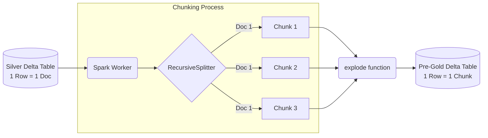

# Lesson 4: Advanced Chunking Strategies

Welcome to Phase 2. We now have a Silver table full of clean, extracted text from our PDF manuals and JSON product catalogs. Before we can turn this text into vectors, we must "chunk" it.

## 1. Business Context

**Who requested this?**
The AI Engineering Team.

**Why?**
LLMs have a maximum context window (e.g., Llama 3 has 8k or 128k tokens). We cannot pass a 500-page espresso machine manual into the prompt every time someone asks a question. It's too slow and too expensive. 

**Business Impact**
Accurate chunking dictates whether the LLM finds the *right* answer. If a chunk splits a sentence in half, the meaning is lost, and the AI hallucinates.

**Customer Problem**
"The AI gave me the return policy for a TV when I asked about a blender." (This happens when chunks overlap incorrectly or lack metadata).

**ROI & Metrics**
*   **Token Efficiency:** Sending 3 relevant chunks (1,000 tokens) instead of a full document (100,000 tokens) saves ~$0.05 per query. Multiplied by 10,000 users daily, this saves $15,000/month.

---

## 2. Simple Analogy

Imagine trying to memorize an encyclopedia. You don't memorize it as one giant string of words. You break it down by Chapters, then Sections, then Paragraphs. 
Chunking is the process of breaking down a massive document into digestible "paragraphs" (chunks) so that when you need to recall information, you only pull the specific paragraph you need.

---

## 3. First Principles

*   **What:** Dividing long text into smaller, semantically meaningful pieces.
*   **Why:** To fit within LLM context limits and improve vector search relevance. A vector representing a 500-word paragraph is highly specific. A vector representing a 50-page chapter is a diluted, average vector of many topics.
*   **How:** Using libraries like LangChain's TextSplitters.
*   **When:** Between the Silver (Clean Text) and Gold (Vector/Embedding) layers.
*   **Tradeoffs:** Small chunks = high search accuracy, but missing surrounding context. Large chunks = rich context, but poor search accuracy (diluted embeddings) and high token cost.
*   **Failure Scenarios:** Splitting a table in half. Splitting a Python code block in half. The LLM receives broken syntax.

---

## 4. Internal Working

1.  **Read Silver Text:** Pull a long string of text.
2.  **Splitter Initialization:** Define the `chunk_size` (e.g., 500 tokens) and `chunk_overlap` (e.g., 50 tokens). The overlap ensures we don't cut a sentence in half without some context bleeding into the next chunk.
3.  **Recursive Splitting:** The algorithm tries to split by `\n\n` (paragraphs). If a paragraph is still too big, it splits by `\n` (sentences), then by ` ` (words).
4.  **Metadata Attachment:** Every chunk *must* retain the `file_path` or `source_id` from the original document.

---

## 5. Databricks Implementation

We will use a PySpark Pandas UDF again, but this time we will wrap LangChain's `RecursiveCharacterTextSplitter`. 

Why LangChain here? Because chunking logic is complex (especially semantic chunking), and LangChain provides industry-standard utilities that are thoroughly tested. We don't reinvent the wheel.

---

## 6. Production Code

We will create `src/shopsphere_genai/embeddings/chunker.py`.

*(See the actual file in your workspace for the code)*

---

## 7. Explain Every Line of Code

Looking at `src/shopsphere_genai/embeddings/chunker.py`:

*   `from langchain.text_splitter import RecursiveCharacterTextSplitter`: The gold standard for basic chunking.
*   `chunk_size=500, chunk_overlap=50`: We define sizes. Why 500? Because typical embedding models (like BGE-large) perform best on 256 to 512 tokens. An overlap of 50 ensures continuity.
*   `def chunk_text_udf(text_series: pd.Series) -> pd.Series:` Another Pandas UDF, but notice the return type. It returns an *Array of Strings*. One document (1 row) becomes Many chunks (an Array).
*   `.select("source_path", explode("chunks").alias("chunk_content"))`: The most important PySpark line. `explode()` takes an array and turns it into multiple rows. If Row 1 had an array of 5 chunks, it becomes 5 distinct rows in the DataFrame.

---

## 8. Architecture Diagram

---

## 9. Production Problems

**The Problem: Tables and Markdown**
Recursive splitting destroys tables. If a PDF has a pricing table, splitting it arbitrarily makes the data useless to the LLM.
*   **The Senior Solution:** **Markdown Chunking.** First, use a parsing tool that converts PDFs to Markdown (like `Unstructured` or LLM-based vision extraction). Then, use LangChain's `MarkdownHeaderTextSplitter`. This chunks data based on `# Headers`, keeping entire sections (like tables) intact under their specific header context.

**The Problem: "Lost in the Middle"**
If you use large chunks (1000+ tokens) and return the top 10 chunks to the LLM, the LLM often ignores the context in the middle chunks.
*   **The Senior Solution:** Keep chunk sizes strictly under 500 tokens.

---

## 10. Design Decisions (Advanced Comparison)

| Strategy | Pros | Cons | Use Case |
| :--- | :--- | :--- | :--- |
| **Recursive Character** | Fast, standard, cheap. | Dumb. Cuts off logical thoughts. | General unstructured text (novels, long emails). |
| **Semantic Chunking** | Splits based on meaning (uses embeddings to find topic shifts). | Very slow. Expensive (requires embedding model calls during chunking). | Highly technical, dense documentation. |
| **Markdown Chunking** | Perfect logical boundaries. | Requires the input to be perfect Markdown. | Documentation, Git repos, API docs. |
| **Parent-Child (Small-to-Big)** | Embeds small sentences (highly accurate search), but returns the whole parent paragraph to the LLM. | Complex to manage mapping. | Enterprise RAG where precision is critical. |

*Decision:* For ShopSphere, we start with **Recursive**. As we evolve to Phase 3, we will upgrade to **Parent-Child**.

---

## 11. Cost Engineering

Chunking itself is cheap (just CPU time). The *cost* of chunking decisions impacts downstream inference.
If `chunk_size = 1000`, we send more tokens to the LLM per query. At $0.90 per million tokens (Llama 3 70B), sending 5 large chunks (5000 tokens) costs $0.0045 per query. Sending 5 small chunks (1000 tokens) costs $0.0009. 
**Optimization:** Small, highly relevant chunks save 80% on inference costs.

---

## 12. Enterprise Constraints

**Requirement:** Traceability for auditing.
*   **Redesign impact:** When the AI gives an answer, the user must be able to click a link to see the exact paragraph in the original PDF. Therefore, our chunked Delta table must include a `chunk_id`, the `source_path`, and ideally, the `page_number` extracted during Lesson 3.

---

## 13. Architecture Review (Principal Engineer Defense)

**Principal:** "Why are you exploding the array of chunks into separate rows in Delta? Why not keep them as an array in one row?"
**You:** "Because of Vector Search requirements. Databricks Vector Search syncs row-by-row. One row equals one embedding vector. If we kept them as an array, we'd have to average the embeddings, which dilutes the semantic meaning completely. Exploding them normalizes the data for the vector index."

---

## 14. Refactoring Journey

*   **Version 1:** `text.split("\n\n")`. Too naive.
*   **Version 2:** Standard LangChain splitter in a for-loop. Slow.
*   **Version 3 (Our Code):** LangChain splitter wrapped in a Pandas UDF with `explode()`, allowing parallel chunking of millions of documents in seconds.

---

## 15. Interview Preparation (Senior Level)

1.  **System Design:** "Explain the Parent-Child chunking strategy and why it improves RAG performance over naive chunking."
2.  **Tradeoffs:** "What happens if your chunk overlap is too large? Too small?"
3.  **Architecture:** "How do you preserve metadata (like document title and author) when chunking a massive corpus?"
4.  **Debugging:** "Your RAG agent is returning irrelevant answers, but you know the document is in the database. What's the first thing you check?" (Answer: The chunk size and the chunk text itself).
5.  **Coding:** "Write a PySpark script to chunk text and explode it into multiple rows."

---

## 16. Resume Thinking

**How to talk about this project:**
*   **Bullet:** *Optimized RAG retrieval precision by implementing advanced distributed chunking strategies (Recursive and Semantic) utilizing PySpark and LangChain, significantly reducing LLM token costs.*
