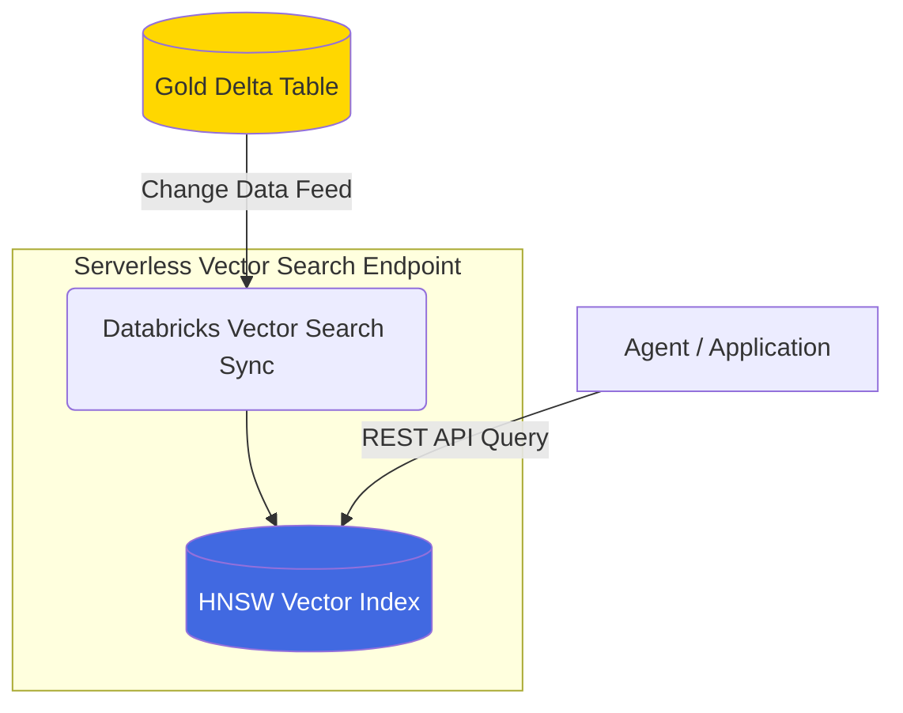

# Lesson 6: Databricks Vector Search

We have a Delta table containing text chunks and their dense vector embeddings. Now we need a highly optimized engine that can perform sub-millisecond similarity searches on those vectors.

## 1. Business Context

**Who requested this?**
Backend Engineering & Ops.

**Why?**
Scanning a Delta table row-by-row to compute cosine similarity against 10 million vectors using PySpark takes minutes. A production AI system needs to respond in < 1 second. We need a Vector Database.

**Business Impact**
Scalable, low-latency recall of corporate knowledge.

**Customer Problem**
"The chatbot takes 30 seconds to answer my question."

**ROI & Metrics**
*   **Latency:** Reduce retrieval time from minutes (batch Spark) to ~20 milliseconds (Vector DB).

---

## 2. Simple Analogy

Imagine a physical dictionary.
If you are looking for the word "Zebra" and the dictionary is completely unorganized (a standard Delta table without an index), you have to start at page 1 and read every word until you find it.
A Vector Search Index is like alphabetical ordering and edge-tabs. It organizes the vectors hierarchically (e.g., using HNSW algorithms) so that the system only needs to check a tiny fraction of the data to find the nearest neighbors.

---

## 3. First Principles

*   **What:** A specialized database index optimized for storing and retrieving high-dimensional vectors.
*   **Why:** To perform K-Nearest Neighbors (KNN) or Approximate Nearest Neighbors (ANN) search at scale.
*   **How:** Using Databricks Mosaic AI Vector Search, which provisions a serverless compute endpoint to hold the index in memory.
*   **When:** The final storage layer for unstructured data before the LLM app queries it.
*   **Tradeoffs:** Holding millions of vectors in RAM is expensive. You trade infrastructure cost for extreme low-latency performance.
*   **Failure Scenarios:** The Delta table updates, but the Vector index fails to sync. The LLM starts answering based on stale data.

---

## 4. Internal Working

1.  **Delta Trigger:** A new row is inserted into `gold_document_vectors`.
2.  **Change Data Feed (CDF):** Because we enabled `enableChangeDataFeed` in Lesson 5, Delta tracks exactly which rows were added/modified/deleted.
3.  **Sync Event:** Databricks Vector Search reads the CDF and pulls only the changed rows.
4.  **HNSW Graph Update:** The Vector DB updates its Hierarchical Navigable Small World (HNSW) graph in memory to place the new vector in the correct neighborhood.
5.  **Querying:** When a user queries, the Vector DB traverses the graph to find the `top_k` closest vectors using Cosine Similarity.

---

## 5. Databricks Implementation

*   **Vector Search Endpoints:** The physical (serverless) compute cluster that hosts the indices.
*   **Vector Search Index:** The logical database tied to a specific Delta table.
*   **Direct Access:** Vector Search in Databricks is fully governed by Unity Catalog. If a user doesn't have `SELECT` on the source Delta table, they cannot query the Vector Index.

---

## 6. Production Code

We will create `src/shopsphere_genai/search/vector_db.py`.

*(See the actual file in your workspace for the code)*

---

## 7. Explain Every Line of Code

Looking at `src/shopsphere_genai/search/vector_db.py`:

*   `from databricks.vector_search.client import VectorSearchClient`: We use the Databricks Python SDK to manage the index.
*   `vsc.create_endpoint(...)`: Provisions the serverless compute. This takes a few minutes if the endpoint doesn't exist.
*   `vsc.create_delta_sync_index(...)`: The most important method. We tell the Vector DB:
    *   `source_table`: Our Gold Delta table.
    *   `index_name`: Where to build it in Unity Catalog.
    *   `pipeline_type="TRIGGERED"`: We will manually trigger the sync (or use a Workflow) to save costs. Production often uses `"CONTINUOUS"`.
    *   `primary_key="chunk_id"`: Essential for upserts/deletes.
    *   `embedding_vector_column="embedding_vector"`: Tells the index which column holds the float array.

---

## 8. Architecture Diagram

---

## 9. Production Problems

**The Problem: The "Deleted Record" Ghost**
A user's PII is accidentally ingested. Legal demands you delete the PDF. You delete it from the raw Volume and run a `DELETE FROM bronze` and `DELETE FROM gold`. The data is gone from Delta. But if your Vector Index doesn't support CDF deletes, the LLM will still retrieve the PII!
*   **The Senior Solution:** Databricks Vector Search automatically handles `DELETE` operations via the Delta Change Data Feed. Always ensure `enableChangeDataFeed` is true on the source table, and always use a primary key.

---

## 10. Design Decisions (Vector DB Comparison)

| Database | Ecosystem | Pros | Cons |
| :--- | :--- | :--- | :--- |
| **Databricks VS** | Databricks native | Zero-ETL Delta Sync, Unity Catalog governance, Serverless. | Locked into Databricks. |
| **Pinecone** | SaaS | Extremely fast, great API, independent. | Egress costs, complex security sync (RBAC mismatch), manual ETL required to push data. |
| **Milvus / FAISS**| Open Source | Free, highly customizable. | You manage the Kubernetes clusters, high DevOps overhead, no out-of-the-box Delta sync. |

*Decision:* We use Databricks VS because the security model (Unity Catalog) automatically applies to the index. A massive win for enterprise compliance.

---

## 11. Cost Engineering

*   **Endpoint Cost:** A small Vector Search endpoint costs roughly ~$0.70/hour while running. 
*   **Optimization:** In a Dev environment, do not leave the endpoint running 24/7. Use Databricks REST API to spin it down when not in use. In Production, monitor the query load and scale the endpoint up to medium/large only if P99 latency exceeds 100ms.

---

## 12. Enterprise Constraints

**Requirement:** Row-Level Security (RLS). Store managers can only search documents related to their region.
*   **Redesign impact:** Databricks Vector Search preview supports RLS by passing the user's identity through the serving endpoint. The index will filter the nearest neighbors based on the UC row-level filters applied to the source Delta table before returning results.

---

## 13. Architecture Review (Principal Engineer Defense)

**Principal:** "Why are we using a 'TRIGGERED' pipeline type instead of 'CONTINUOUS'? Doesn't this mean our search results are stale?"
**You:** "It's a deliberate cost/freshness trade-off. Our documents (store manuals, product specs) only arrive once a day via batch uploads from vendors. A CONTINUOUS sync keeps compute running 24/7 waiting for changes that only happen at 2 AM. By using TRIGGERED, we orchestrate the sync immediately after the daily embedding pipeline finishes, cutting sync compute costs by 95% while maintaining functional real-time freshness."

---

## 14. Refactoring Journey

*   **Version 1:** Loading embeddings into Pandas and using `scipy.spatial.distance.cosine`. (Crashes your laptop).
*   **Version 2:** Exporting Delta tables to CSV and pushing to Pinecone via REST API. (Security nightmare).
*   **Version 3 (Our Code):** Native Databricks Delta Sync Index with Unity Catalog governance.

---

## 15. Interview Preparation (Senior Level)

1.  **Architecture:** "How do you ensure that a document deleted from your data lake is also instantly deleted from your Vector Database?"
2.  **System Design:** "Compare Databricks Vector Search with Pinecone for an enterprise already fully invested in Unity Catalog."
3.  **Tradeoffs:** "TRIGGERED vs CONTINUOUS vector sync pipelines."
4.  **Debugging:** "Your Vector Search queries are returning empty results, but the Delta table is full. What is the most likely cause?" (Answer: The sync pipeline hasn't been triggered, or CDF is disabled).
5.  **Coding:** "Write the Python SDK code to create a Delta Sync Vector Index."

---

## 16. Resume Thinking

**How to talk about this project:**
*   **Bullet:** *Deployed serverless Vector Search indices with zero-ETL Delta Lake synchronization, achieving sub-50ms retrieval latency while inheriting strict Unity Catalog data governance.*
