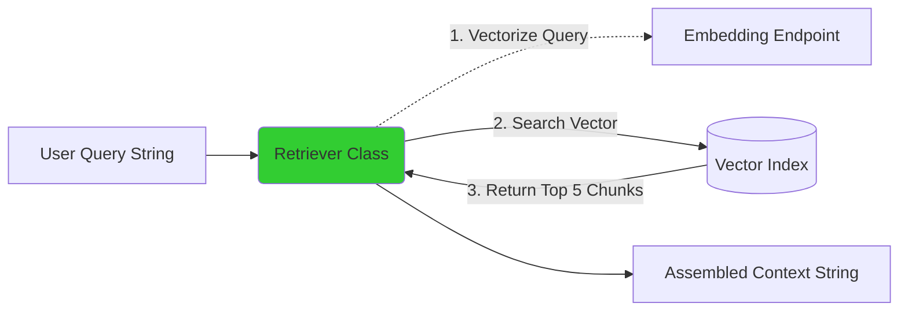

# Lesson 7: The Retriever

We have built the entire data ingestion and indexing pipeline. Our Vector Database is online. Now, it's time to pull data *out* of it based on a user's question. This is the "R" in RAG.

## 1. Business Context

**Who requested this?**
The Application Development Team.

**Why?**
The frontend UI (e.g., a Streamlit app or a Slack bot) cannot interface directly with PySpark jobs or Delta tables. It needs a Python function it can call: `get_relevant_context("query")` that returns lightning-fast results.

**Business Impact**
This is the core search capability. Without a good retriever, the LLM is flying blind.

**Customer Problem**
"When I ask about coffee machines, the AI sometimes gives me answers about blenders." (This is a failure of the Retriever, not the LLM).

**ROI & Metrics**
*   **Mean Reciprocal Rank (MRR):** If the correct document is returned as result #1, MRR is 1.0. If it's #5, MRR is 0.2. We aim for MRR > 0.8.

---

## 2. Simple Analogy

The Retriever is the search bar in your email client. 
When you type "flights to New York," the retriever doesn't read the emails to you. It just hands you a stack of 5 emails that contain the flight details. 
You (the LLM) then read those 5 emails to figure out exactly what time your flight leaves.

---

## 3. First Principles

*   **What:** A system that accepts a natural language query, converts it to a vector, and queries the Vector DB for the nearest neighbors.
*   **Why:** To assemble the "Context" that will be injected into the LLM's prompt.
*   **How:** Using the `VectorSearchClient` to call `index.similarity_search()`.
*   **When:** The first step that happens *after* the user hits "Enter" in the chat UI.
*   **Tradeoffs:** Fetching Top-K = 3 is fast and cheap, but might miss nuance. Fetching Top-K = 20 guarantees you find the info, but you might exceed the LLM's token limit or cause "Lost in the Middle" syndrome.
*   **Failure Scenarios:** The embedding model API goes down. The Retriever cannot convert the user's string into a vector, so the search fails completely.

---

## 4. Internal Working

1.  **Query Input:** "What is the return policy for electronics?"
2.  **Query Embedding:** The Retriever calls the *exact same* embedding model used in Lesson 5 (e.g., `databricks-bge-large-en`). The query string becomes an array of floats.
3.  **Similarity Search:** The Retriever sends this float array to the Vector DB endpoint.
4.  **Distance Calculation:** The DB calculates the Cosine Distance between the query vector and the millions of indexed vectors.
5.  **Metadata Extraction:** The DB returns the top 5 closest vectors, *along with their original text and source paths*.
6.  **Context Assembly:** The Retriever concatenates the 5 text chunks into one long string.

---

## 5. Databricks Implementation

We will use the `VectorSearchClient` again, but this time in a "read" capacity. 
*Crucially*, Databricks Vector Search can handle the query embedding step for us if we configure it to, but in this lesson, we explicitly pass the text query and let the client handle the embedding endpoint call.

---

## 6. Production Code

We will create `src/shopsphere_genai/search/retriever.py`.

*(See the actual file in your workspace for the code)*

---

## 7. Explain Every Line of Code

Looking at `src/shopsphere_genai/search/retriever.py`:

*   `class ShopSphereRetriever:` Encapsulates the retrieval logic. In an enterprise, this class will be injected into your Agent framework.
*   `index.similarity_search(...)`: The core API call.
*   `query_text=query`: We pass the raw text. Because we configured the index properly, Databricks automatically calls the embedding endpoint for us under the hood to vectorize this string.
*   `columns=["chunk_content", "source_path"]`: We tell the DB what metadata to return. We don't want the actual vector array back (it's useless to the LLM and wastes bandwidth); we want the text.
*   `num_results=top_k`: How many chunks to return. Usually between 3 and 10.
*   `filters={"source_system": "Vendor_Portal"}`: (Optional) This is where we implement **Hybrid Search**. We can filter by structured metadata *before* executing the semantic vector search.

---

## 8. Architecture Diagram

---

## 9. Production Problems

**The Problem: The "Cold Start" Latency**
Serverless Vector Search endpoints spin down if unused. The first query of the morning takes 45 seconds while the endpoint boots up. The UI times out.
*   **The Senior Solution:** Implement a "warmup" cron job (e.g., a Databricks Workflow) that pings the retriever every 10 minutes with a dummy query during business hours to prevent cold starts.

**The Problem: Poor Keyword Matches**
A user searches for "SKU-12345". Semantic search is terrible at exact keyword matches (SKUs, IDs, Names). The vector for "SKU-12345" might be randomly close to "SKU-12346".
*   **The Senior Solution:** **Hybrid Search**. You must combine Vector Search (for concepts) with Keyword Search (BM25 or Lucene) for exact matches. Databricks Vector Search supports Hybrid Search natively.

---

## 10. Design Decisions

**Why not just use LangChain's `DatabricksVectorSearch` retriever class directly?**
In Phase 3, we will wrap our custom retriever in a LangChain tool. However, writing the raw Databricks SDK implementation first is critical. LangChain obscures errors. If you don't know how the underlying SDK works, you cannot debug a `LangChain HTTP 500 Error` when the endpoint fails.

---

## 11. Cost Engineering

*   **Retrieval Compute:** The query itself is virtually free. The cost is entirely in the uptime of the Vector Search Endpoint.
*   **Caching:** If 10,000 store managers ask "What are the holiday hours?" on December 20th, do not hit the Vector DB 10,000 times. Implement a semantic cache (e.g., Redis or a dedicated fast table) in the Retriever class to return the exact same context for semantically identical queries.

---

## 12. Enterprise Constraints

**Requirement:** Multi-Tenancy. ShopSphere has distinct subsidiary brands (e.g., Brand A and Brand B). Brand A managers must not retrieve Brand B documents.
*   **Redesign impact:** We modify the `similarity_search` call to always include a hardcoded metadata filter: `filters={"brand": user_brand}`. If you forget this filter, you have a massive cross-tenant data leak.

---

## 13. Architecture Review (Principal Engineer Defense)

**Principal:** "Why are we returning 5 chunks? Why not 50? LLMs have 128k context windows now. Just dump everything in."
**You:** "Two reasons: Latency and 'Lost in the Middle' degradation. 
1. The LLM's Time-To-First-Token (TTFT) scales linearly with the input prompt size. Reading 50 chunks takes 10x longer than reading 5 chunks. Our SLA is < 2 seconds.
2. Academic research proves that even with 128k windows, LLMs fail to retrieve facts buried in the middle of massive prompts. Tight, precise retrieval (Top 5) yields higher accuracy than dumping the whole database."

---

## 14. Refactoring Journey

*   **Version 1:** Returning a raw JSON dictionary from the SDK.
*   **Version 2:** Formatting the JSON into a readable string.
*   **Version 3 (Our Code):** Returning a structured list of dictionaries with sources, ready for LLM consumption or citation rendering in a UI.

---

## 15. Interview Preparation (Senior Level)

1.  **Architecture:** "How do you implement Hybrid Search (Keyword + Semantic) in a production RAG system?"
2.  **Debugging:** "Users complain the chatbot gives great answers for general questions but fails completely when asked about specific product IDs. Why?" (Answer: Pure semantic search fails on UUIDs/SKUs. Need Hybrid search).
3.  **System Design:** "Design a semantic caching layer for a high-traffic Retriever to reduce Vector DB load."
4.  **Tradeoffs:** "Large Top-K vs Small Top-K."
5.  **Coding:** "Write a Python function using the Databricks SDK that queries a Vector Index and formats the result."

---

## 16. Resume Thinking

**How to talk about this project:**
*   **Bullet:** *Developed a low-latency (P99 < 100ms) semantic retrieval engine utilizing Databricks Vector Search, incorporating metadata filtering for multi-tenant data isolation.*
