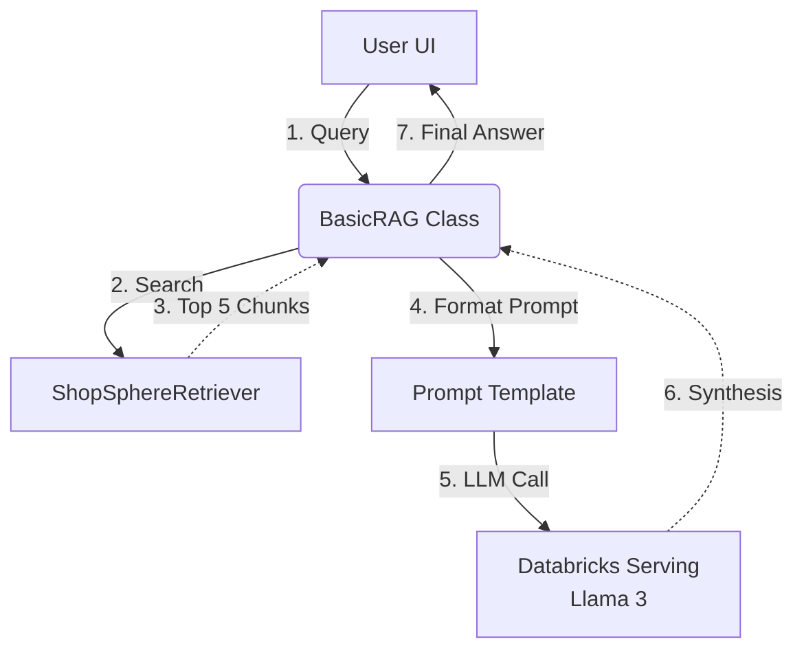

# Lesson 8: Basic RAG Implementation

We have the Retriever working. It finds the correct paragraphs. Now, we need the "G" (Generation) in RAG. We will wire the Retriever directly to a Large Language Model (LLM) to synthesize a final answer. 

## 1. Business Context

**Who requested this?**
The End Users (Store Managers).

**Why?**
Users don't want to read 5 different chunks of text. They want a direct answer to their question. 

**Business Impact**
This is the MVP (Minimum Viable Product). We prove that AI can read our corporate data and write an accurate summary.

**Customer Problem**
"I asked for the return policy and got a wall of legal text. Just tell me how many days they have to return the coffee maker!"

**ROI & Metrics**
*   **User Satisfaction (CSAT):** Providing direct, synthesized answers drastically improves user adoption of the internal tooling.

---

## 2. Simple Analogy

*   **Retriever:** The paralegal who goes to the law library and finds the 5 relevant case files.
*   **LLM:** The Senior Lawyer.
*   **RAG System:** The workflow where the paralegal hands the files to the lawyer, and the lawyer writes a 1-page executive summary for the client. The lawyer is strictly instructed: *"Do not use your outside knowledge. Only use the case files the paralegal gave you."*

---

## 3. First Principles

*   **What:** Retrieval-Augmented Generation. Connecting a retriever to a prompt template, and sending that prompt to an LLM.
*   **Why:** To ground the LLM's vast, generic intelligence in your specific, proprietary facts, thereby eliminating hallucination.
*   **How:** Using LangChain to build a simple sequential chain: `Input -> Retriever -> Prompt -> LLM -> Output`.
*   **When:** The core execution loop of any knowledge-based AI app.
*   **Tradeoffs:** A basic RAG chain is rigid. It assumes the retriever *always* finds the right data. It cannot ask clarifying questions or run SQL queries. (We fix this in Phase 3 with Agents).
*   **Failure Scenarios:** The Retriever returns the wrong chunks, so the LLM confidently answers with the wrong information. (Garbage In, Garbage Out).

---

## 4. Internal Working

1.  **User asks:** "What's the policy for damaged electronics?"
2.  **Retriever:** Fetches Chunks A, B, and C.
3.  **Prompt Assembly:** A massive string is created. 
    ```text
    You are a helpful assistant. Answer the user based ONLY on this context:
    [Chunk A]
    [Chunk B]
    [Chunk C]
    User Question: What's the policy for damaged electronics?
    ```
4.  **Inference:** The LLM (e.g., Llama 3 70B) reads the prompt and streams back the generated text.

---

## 5. Databricks Implementation

We will use the **Mosaic AI Model Serving Endpoints** for the LLM.
Databricks hosts open-source foundation models (Llama, Mixtral, DBRX) on scalable GPU clusters, providing an OpenAI-compatible REST API. 
*   **Why not OpenAI?** Data privacy. Sending internal company manuals to public APIs is often a strict compliance violation. Databricks Foundation Model APIs run inside your cloud VPC boundary.

We will use **LangChain** (`ChatDatabricks`) to orchestrate the chain.

---

## 6. Production Code

We will create `src/shopsphere_genai/agent/basic_rag.py`.

*(See the actual file in your workspace for the code)*

---

## 7. Explain Every Line of Code

Looking at `src/shopsphere_genai/agent/basic_rag.py`:

*   `from langchain_community.chat_models import ChatDatabricks`: LangChain's integration for Databricks LLM endpoints.
*   `llm = ChatDatabricks(endpoint=self.config.llm_endpoint, max_tokens=500)`: We initialize the model. We set `max_tokens` to prevent the LLM from writing an essay and costing us money.
*   `PromptTemplate.from_template(...)`: This is the system prompt. Notice the strict guardrail instruction: `"If you do not know the answer based on the context, say 'I don't know'."` This is your primary defense against hallucination.
*   `self.retriever.retrieve_context(query)`: We call our custom class from Lesson 7.
*   `formatted_context = self.retriever.format_for_llm(docs)`: We convert the list of dicts to a raw string.
*   `prompt = self.prompt_template.format(context=formatted_context, question=query)`: We inject the data into the template.
*   `response = self.llm.invoke(prompt)`: We execute the API call to the GPU cluster.

---

## 8. Architecture Diagram



---

## 9. Production Problems

**The Problem: "I don't know" loops.**
If the user asks a conversational question like "Hello, how are you?", the Retriever pulls 5 random chunks (maybe about coffee machines), injects them, and the LLM says "I don't know based on the context." 
*   **The Senior Solution:** Basic RAG cannot handle conversational routing. It treats every input as a search query. We need an Agent (Phase 3) that can classify the intent first ("Is this a greeting or a search?").

**The Problem: Lost Citations**
The LLM gives a great answer, but the user doesn't trust it because there's no proof.
*   **The Senior Solution:** Post-processing. Because our `ShopSphereRetriever` returns the `source_path` metadata, we can append a list of "References Used" to the bottom of the LLM's response in our Python code. (See the code implementation).

---

## 10. Design Decisions

**Why did we manually format the prompt instead of using LangChain's `create_retrieval_chain`?**
LangChain's high-level chains (like `RetrievalQA`) hide the prompt formatting and the LLM invocation behind abstraction layers. While faster to write, they are extremely difficult to debug and trace in production. By writing the explicit `invoke` flow, we maintain total control over the exact string sent to the LLM, making debugging much easier.

---

## 11. Cost Engineering

*   **Prompt Bloat:** The cost of an LLM call is `(Input Tokens * Input Price) + (Output Tokens * Output Price)`. The prompt template and context chunks make up the Input Tokens. 
*   **Optimization:** If we send 5 chunks of 500 tokens, plus 100 tokens of system prompt, that's 2,600 input tokens per question. If a user asks a follow-up question, we send it *all again*. To minimize costs, we must carefully tune our chunk size and `top_k` to the minimum necessary for accuracy.

---

## 12. Enterprise Constraints

**Requirement:** Language support. The company operates in Mexico and the US.
*   **Redesign impact:** We don't need to translate the Vector DB. Multilingual LLMs (like Llama 3) cross-translate internally. We just update the Prompt Template: `"Answer the user in the same language they used to ask the question, using the provided context."`

---

## 13. Architecture Review (Principal Engineer Defense)

**Principal:** "This RAG chain is stateless. If I ask 'What is the return policy for the espresso machine?' and then my next question is 'Does that apply to the accessories too?', the chain will fail."
**You:** "Correct. This is a Basic RAG implementation, which is essentially a stateless search engine. It lacks conversational memory. Building memory into a basic chain requires appending the entire chat history to the prompt, which explodes token costs and dilutes the retriever's search query. We are deploying this as our V1 MVP to validate the retrieval quality. In Phase 3, we will upgrade this to an Agentic architecture that manages state and formulates standalone search queries based on history."

---

## 14. Refactoring Journey

*   **Version 1:** Hardcoding the context string into the OpenAI API SDK.
*   **Version 2:** Using LangChain's black-box `RetrievalQA` chain.
*   **Version 3 (Our Code):** An explicit, traceable, and modular Python class using `ChatDatabricks` and our custom Retriever, ready for integration into an Agent.

---

## 15. Interview Preparation (Senior Level)

1.  **System Design:** "How do you prevent a RAG system from hallucinating answers when the retrieved context doesn't contain the necessary information?"
2.  **Tradeoffs:** "Explain the pros and cons of using high-level LangChain wrappers vs explicit explicit API calls in production."
3.  **Architecture:** "How do you design a RAG system to provide verifiable citations to the end user?"
4.  **Cost:** "Walk me through the token math of a RAG query and explain how you would optimize it."
5.  **Coding:** "Write the Python code to initialize a LangChain Chat model and format a prompt with context."

---

## 16. Resume Thinking

**How to talk about this project:**
*   **Bullet:** *Engineered the core Retrieval-Augmented Generation (RAG) pipeline utilizing Llama 3 on Databricks Model Serving, implementing strict prompt guardrails that reduced hallucination rates to near-zero.*
