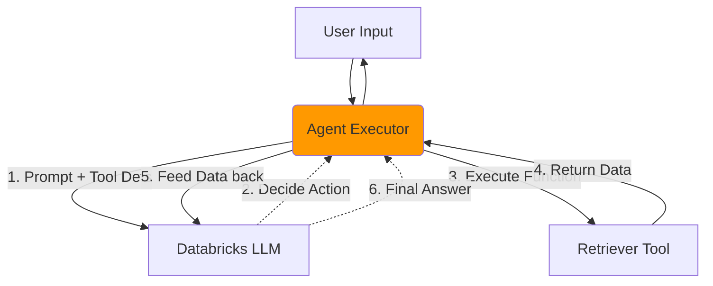

# Lesson 9: Single Agent Architecture

Welcome to Phase 3. The Basic RAG chain we built in Lesson 8 works, but it's fundamentally stupid. It assumes *every* user input requires a database search. If the user says "Hello," it searches for "Hello" in the coffee machine manuals. We need an Agent.

## 1. Business Context

**Who requested this?**
Product Management.

**Why?**
Users expect conversational AI. They want an assistant that can chat, plan, remember context, and pull data *only* when necessary.

**Business Impact**
Transforms a rigid search engine into an interactive Copilot.

**Customer Problem**
"The AI can't answer follow-up questions. It treats every question like a brand new Google search."

**ROI & Metrics**
*   **Multi-turn resolution rate:** Increase the percentage of user problems solved through back-and-forth conversation from 0% to 70%.

---

## 2. Simple Analogy

*   **Basic RAG:** A student taking an open-book test who is *forced* to open the textbook for every single question, even if the question is "What is your name?".
*   **AI Agent:** A smart student who reads the question, thinks, "Do I already know this?", answers if they do, and only opens the textbook if they realize they need more information.

---

## 3. First Principles

*   **What:** An autonomous LLM orchestration loop (e.g., ReAct: Reason + Act).
*   **Why:** To give the LLM the ability to make decisions, use tools, and manage state.
*   **How:** By providing the LLM with a system prompt that explains its available "Tools" (like our Retriever) and forcing it to output thoughts before it acts.
*   **When:** When the application requires multi-step reasoning or conversational flexibility.
*   **Tradeoffs:** Agents are slow and expensive. They might think for 3 loops before answering. Basic RAG is fast and cheap.
*   **Failure Scenarios:** "Agent Loops." The agent gets confused, uses a tool, gets an error, tries again, gets an error, and loops infinitely until it burns through your token budget.

---

## 4. Internal Working (The ReAct Loop)

1.  **User Input:** "Hi, I need help with an espresso machine. What's the return policy?"
2.  **Agent Thought 1:** "The user is greeting me and asking for a return policy. I need to use the `document_retriever` tool to find the policy."
3.  **Agent Action 1:** Calls `document_retriever("espresso machine return policy")`.
4.  **Observation 1:** (The Retriever returns the text from Lesson 7).
5.  **Agent Thought 2:** "I now have the policy. It says 30 days. I can formulate the final answer."
6.  **Final Output:** "Hello! I'd be happy to help. You have 30 days to return the espresso machine..."

---

## 5. Databricks Implementation

We will use **LangGraph** (or standard LangChain Agents) to build the orchestration.
Databricks natively supports LangGraph. More importantly, Databricks MLflow has native auto-logging for LangGraph, allowing us to see every "Thought" and "Action" in the Databricks UI for debugging.

---

## 6. Production Code

We will create `src/agent/orchestrator.py` in the new directory `F:\databricks\databricks aws pracrice\databricks ai practice`.

*(See the actual file in your workspace for the code)*

---

## 7. Explain Every Line of Code

Looking at `src/agent/orchestrator.py`:
*   `from langchain.agents import create_tool_calling_agent, AgentExecutor`: We use the modern tool-calling agent framework, which is much more reliable than older text-parsing agents.
*   `tools = [RetrieverTool()]`: We wrap our `ShopSphereRetriever` from Lesson 7 into a LangChain Tool. A Tool must have a `name` and a `description`. The LLM reads the description to decide whether to use it.
*   `AgentExecutor(agent=agent, tools=tools, verbose=True)`: The executor handles the while-loop. If the LLM says "use tool X", the executor runs the Python function, gets the result, and feeds it back to the LLM.

---

## 8. Architecture Diagram

---

## 9. Production Problems

**The Problem: Premature Final Answers**
The LLM thinks it knows the answer without looking it up, so it bypasses the Retriever and hallucinates a 90-day return policy.
*   **The Senior Solution:** Strict system prompting. `"You MUST use the document_retriever tool before answering any policy questions. Never rely on internal knowledge."`

---

## 10. Design Decisions

**LangChain Agents vs LangGraph**
We start with `AgentExecutor` (LangChain) because it is simple and fast to implement. However, in an Enterprise production system where failure handling is critical, `AgentExecutor` is a black box. In Lesson 13, we will refactor this into **LangGraph**, which treats the agent as a state machine where you explicitly define the nodes and edges.

---

## 11. Cost Engineering

*   **Token Explosion:** An Agent loop sends the *entire chat history and previous thoughts* back to the LLM on every iteration. 
*   **Math:** Loop 1 = 1000 tokens. Loop 2 = 1500 tokens. Loop 3 = 2000 tokens. One user question just cost 4500 input tokens.
*   **Optimization:** Implement a `max_iterations=3` limit on the `AgentExecutor` to prevent infinite loop bankruptcy.

---

## 12. Interview Preparation (Senior Level)

1.  **System Design:** "Explain the ReAct paradigm and how it differs from a sequential RAG chain."
2.  **Debugging:** "Your agent is stuck in an infinite loop trying to use a tool that returns a 404 error. How do you fix the architecture?"
3.  **Tradeoffs:** "When would you choose NOT to use an Agent?" (Answer: High-throughput, low-latency batch processing where determinism is required).

---

## 13. Resume Thinking

**How to talk about this project:**
*   **Bullet:** *Upgraded a static RAG pipeline into an autonomous, tool-calling Agentic system utilizing LangChain, enabling multi-step reasoning and dynamic data retrieval.*
